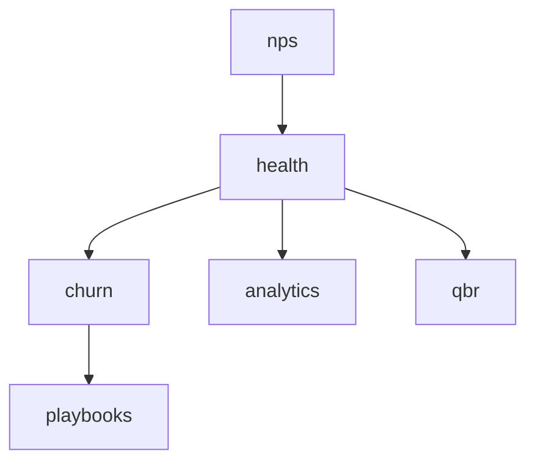

# Customer Success

Health scores, playbooks, churn risk alerts, NPS, QBR management, and analytics. **Panel:** `/crm` (hosted — see [[build/decisions/decision-2026-06-01-panel-consolidation]]) — Phase 3.

Customer Success does NOT have its own panel. Its resources appear in the `/crm` panel under the **Customer Success** nav group. CS operates on CRM accounts.

**Displaces**: Gainsight (SMB), ChurnZero, Vitally

---

## Navigation Groups (within /crm)

- **Customer Success** — Health Scores, Churn Risk, NPS, QBRs, Playbooks, CS Dashboard

---

## Modules

| Module | Key | Status | Priority | Depends on (intra-domain) |
|---|---|---|---|---|
| [[domains/customer-success/health-scores\|Customer Health Scores]] | `cs.health` | planned | p3 | — (anchor) |
| [[domains/customer-success/churn-risk\|Churn Risk Alerts]] | `cs.churn` | planned | p3 | health |
| [[domains/customer-success/playbooks\|CS Playbooks]] | `cs.playbooks` | planned | p3 | — (health soft) |
| [[domains/customer-success/nps\|NPS Surveys]] | `cs.nps` | planned | p3 | — (health soft) |
| [[domains/customer-success/qbr\|QBR Management]] | `cs.qbr` | planned | p3 | — (health soft) |
| [[domains/customer-success/success-analytics\|Success Analytics]] | `cs.analytics` | planned | p3 | health |

## Dependency Graph (intra-domain)



## Cross-Domain Edges

No events of its own. Signals pulled (soft): support.tickets, finance.invoicing, crm accounts. Health recalc → churn evaluation chained nightly.

---

## Status Board (Dataview)

```dataview
TABLE module-key AS "Key", status AS "Status", priority AS "Priority"
FROM "domains/customer-success"
WHERE type = "module"
SORT module-key ASC
```

---

## Key Patterns

- Nightly chained jobs: health recalc → churn evaluation
- Signals from inactive modules excluded + weights renormalised
- Heavy caching of aggregations ([[architecture/caching]])
- Builds on [[domains/crm/contacts]] accounts; CSM = account owner
