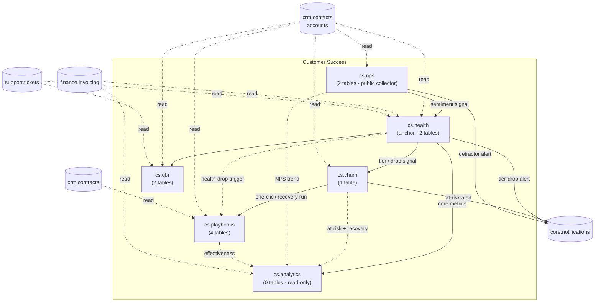

# Customer Success

Health scores, churn-risk alerts, NPS, QBR management, success playbooks, and analytics. CS does **not** have
its own panel — its resources appear in the `/crm` panel under the **Customer Success** nav group (see
[[../../build/decisions/decision-2026-06-01-panel-consolidation]]). CS operates on CRM accounts. Phase 3 — not v1.

**Displaces:** Gainsight (SME), ChurnZero, Vitally, Planhat. Differentiators researched in [[_opportunities]].

All six modules are exploded to folder specs: `<slug>/_module.md` + `architecture` + `data-model`(+ERD, where the
module owns tables) + `api` + `security` + `unknowns` (+ `decisions` where a real decision exists) + `features/<feature>`.
Only `_index.md` and `_opportunities.md` remain as flat files. Conventions:
[[../../decisions/decision-2026-06-20-full-mapping-conventions]].

---

## Navigation Group (within /crm)

- **Customer Success** — Health Scores, Churn Risk, NPS, QBRs, Playbooks, CS Dashboard

---

## Modules

| Module | Key | Tables | Priority | Depends on (intra-domain) | Kind highlights |
|---|---|---|---|---|---|
| [[health-scores/_module\|Customer Health Scores]] | `cs.health` | 2 | p3 | — (anchor) | resource + #4 page |
| [[churn-risk/_module\|Churn Risk Alerts]] | `cs.churn` | 1 | p3 | health | resource |
| [[nps/_module\|NPS Surveys]] | `cs.nps` | 2 | p3 | — (health soft consumer) | 2 resources + custom page |
| [[qbr/_module\|QBR Management]] | `cs.qbr` | 2 | p3 | — (health soft) | resource |
| [[playbooks/_module\|CS Playbooks]] | `cs.playbooks` | 4 | p3 | — (health/churn soft) | 2 resources |
| [[success-analytics/_module\|Success Analytics]] | `cs.analytics` | 0 | p3 | health | custom page |

---

## Domain Map (MOC)



Solid = hard intra-domain dependency; dotted = soft (degrades gracefully). All cross-domain edges to
`crm` / `finance` / `support` / `contracts` are **read-only** through those domains' read APIs — CS never
writes another domain's tables ([[../../security/data-ownership]]).

---

## Cross-Domain Edges (summary)

| Direction | Signal / API | Counterpart |
|---|---|---|
| Reads | accounts + owner (CSM) | crm.contacts |
| Reads | payment status / invoice revenue | finance.invoicing |
| Reads | ticket volume / summary | support.tickets |
| Reads | renewal dates | crm.contracts |
| Writes (via events/notifications) | tier-drop / at-risk / detractor alerts, step reminders | core.notifications |

CS fires **no cross-domain domain events** v1 — all effects are CSM notifications via `core.notifications`.
The nightly **health recalc → churn evaluation** chain is the domain's key sequencing contract.

**Data ownership:** every module writes only its own `cs_*` tables; `cs.analytics` writes nothing at all. See
[[../../security/data-ownership]].

---

## Key Patterns

- Nightly chained jobs: health recalc → churn evaluation (strict ordering).
- Signals from inactive soft-dep modules are excluded + weights renormalised (health) / sections omitted (qbr, analytics).
- Heavy aggregations cached ([[../../architecture/caching]]); NRR uses `brick/money`.
- Public NPS collector is the domain's only unauthenticated surface — token-scoped, no session ([[nps/security]]).
- Builds on [[../crm/contacts/_module|crm.contacts]] accounts; CSM = account `owner_id` *(assumed, domain-wide)*.

---

## Status Board (Dataview)

```dataview
TABLE module-key AS "Key", status AS "Status", priority AS "Priority"
FROM "domains/customer-success"
WHERE type = "module"
SORT module-key ASC
```

---

## Related

- [[_opportunities|CS Opportunities (competitor gaps)]]
- [[../../security/data-ownership]] · [[../../architecture/patterns/feature-ui-spec]]
- [[../../decisions/decision-2026-06-20-full-mapping-conventions]]
- [[../crm/_index|CRM & Sales (host panel)]]
