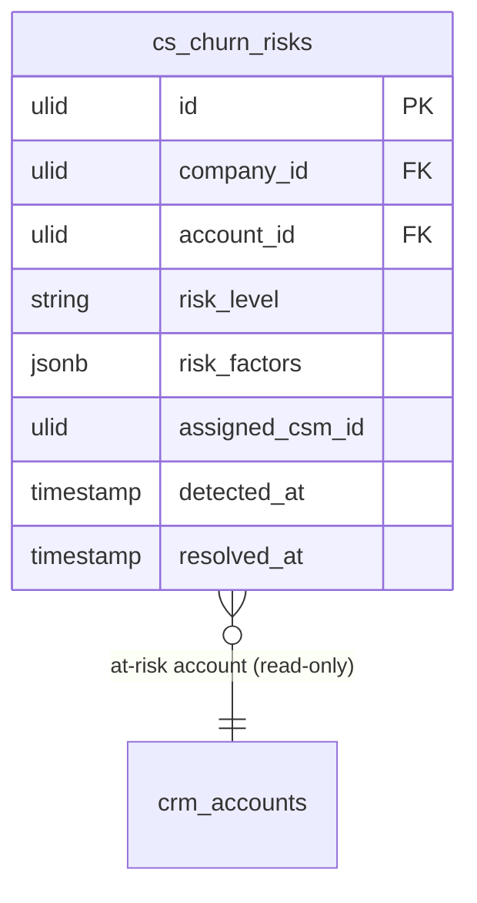

# Churn Risk — Data Model

## cs_churn_risks

| Column | Type | Constraints | Notes |
|---|---|---|---|
| id, company_id (indexed) | ulid | | |
| account_id | ulid | not null FK crm_accounts | scored CRM account (read-only reference) |
| risk_level | string | not null | low / medium / high / critical |
| risk_factors | jsonb | default `[]` | `[{factor, detail}]` — why the account is at risk |
| assigned_csm_id | ulid | nullable | CRM account owner *(assumed)* |
| detected_at | timestamp | not null | first detection of this open risk |
| resolved_at | timestamp | nullable | set when factors clear |

**Constraints:** partial unique `(company_id, account_id) WHERE resolved_at IS NULL` — at most one open risk per account.
**Indexes:** `(company_id, risk_level, resolved_at)`, `(company_id, account_id)`

---

## ERD

`account_id` references `crm_accounts` (owned by [[../../crm/contacts/_module|crm.contacts]]) and `assigned_csm_id` its `owner_id` — both read-only references. This module never writes CRM tables.
