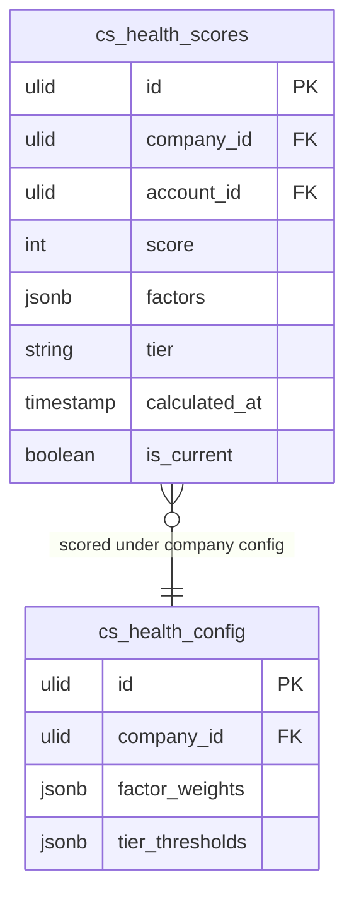

# Health Scores — Data Model

## cs_health_scores

| Column | Type | Constraints | Notes |
|---|---|---|---|
| id, company_id (indexed) | ulid | | |
| account_id | ulid | not null FK crm_accounts | scored CRM account (read-only reference) |
| score | int | not null | 0–100 composite |
| factors | jsonb | default `[]` | `[{factor, value, weight, contribution}]` — per-factor breakdown for explainability |
| tier | string | not null | green / amber / red |
| calculated_at | timestamp | not null | when this row was computed |
| is_current | boolean | default true | one current row per account; prior rows form the trend history *(assumed)* |

**Indexes:** `(company_id, account_id, is_current)`, `(company_id, tier)`, `(company_id, calculated_at)`

---

## cs_health_config

| Column | Type | Constraints | Notes |
|---|---|---|---|
| id, company_id | ulid | unique `(company_id)` | one config row per company |
| factor_weights | jsonb | default `{}` | `{factor: weight}` — weights sum to 100, renormalised over active signals |
| tier_thresholds | jsonb | default `{}` | `{green: 70, amber: 40}` — green ≥70 / amber 40–69 / red <40 *(assumed)* |

---

## ERD

`account_id` references `crm_accounts` (owned by [[../../crm/contacts/_module|crm.contacts]]) as a read-only foreign key — this module never writes CRM tables.
