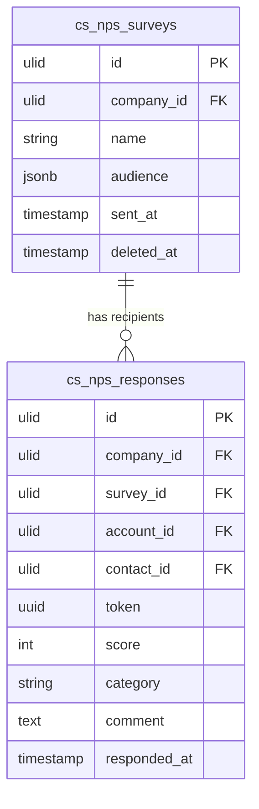

# NPS — Data Model

## cs_nps_surveys

| Column | Type | Constraints | Notes |
|---|---|---|---|
| id, company_id (indexed) | ulid | | |
| name | string | not null | |
| audience | jsonb | default `{}` | `{segment_id}` or `{account_ids: []}` — resolved to recipients at send |
| sent_at | timestamp | nullable | null = draft, not yet sent |
| deleted_at | timestamp | nullable | soft delete |

## cs_nps_responses

| Column | Type | Constraints | Notes |
|---|---|---|---|
| id, company_id (indexed) | ulid | | |
| survey_id | ulid | not null FK cs_nps_surveys | |
| account_id | ulid | nullable | scored CRM account (read-only ref) |
| contact_id | ulid | not null | recipient contact (read-only ref) |
| token | uuid | unique | single-use public response link |
| score | int | nullable, 0–10 | null = sent, unanswered |
| category | string | nullable | promoter / passive / detractor (computed) |
| comment | text | nullable | follow-up |
| responded_at | timestamp | nullable | |

**Constraints:** unique `(survey_id, contact_id)` (one response row per recipient per survey); unique `token`.
**Indexes:** `(company_id, survey_id)`, `(company_id, account_id, responded_at)` (latest per account for the health signal).

---

## ERD

`contact_id` / `account_id` reference `crm_contacts` / `crm_accounts` (owned by [[../../crm/contacts/_module|crm.contacts]]) as read-only foreign keys — this module never writes CRM tables.
