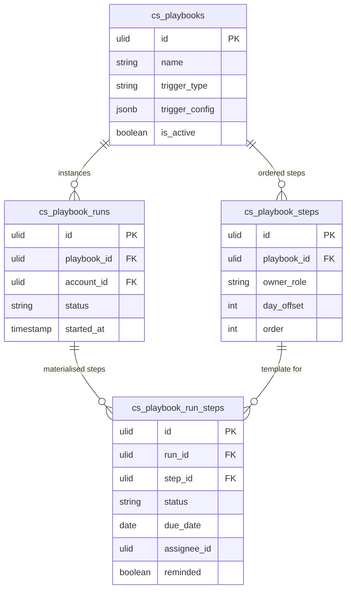

# Playbooks — Data Model

## cs_playbooks

| Column | Type | Constraints | Notes |
|---|---|---|---|
| id, company_id (indexed) | ulid | | |
| name | string | not null | |
| trigger_type | string | not null | manual / health-drop / renewal / new-customer |
| trigger_config | jsonb | default `{}` | per-type config (e.g. renewal window days, health tier) |
| is_active | boolean | default true | |
| deleted_at | timestamp | nullable | soft delete |

## cs_playbook_steps

| Column | Type | Constraints | Notes |
|---|---|---|---|
| id, playbook_id (FK), company_id | ulid | | |
| title | string | not null | |
| description | text | nullable | |
| owner_role | string | not null | csm / manager |
| day_offset | int | default 0 | due = run start + offset days |
| order | int | not null | step sequence |

## cs_playbook_runs

| Column | Type | Constraints | Notes |
|---|---|---|---|
| id, company_id (indexed) | ulid | | |
| playbook_id | ulid | not null FK | |
| account_id | ulid | not null FK crm_accounts | read-only ref |
| status | string | not null | active / completed / cancelled |
| started_at | timestamp | not null | |
| completed_at | timestamp | nullable | |

**Constraint:** partial unique `(company_id, playbook_id, account_id) WHERE status = 'active'` — one active run per (playbook, account).

## cs_playbook_run_steps

| Column | Type | Constraints | Notes |
|---|---|---|---|
| id, run_id (FK), step_id (FK), company_id | ulid | | |
| status | string | not null | open / done / skipped |
| due_date | date | not null | started_at + step.day_offset |
| assignee_id | ulid | nullable | resolved from owner_role (CSM = account owner) |
| completed_at | timestamp | nullable | |
| reminded | boolean | default false | due-reminder guard |

---

## ERD

`account_id` and `assignee_id` reference `crm_accounts` / user records (owner) as read-only foreign keys — this module never writes CRM tables.
