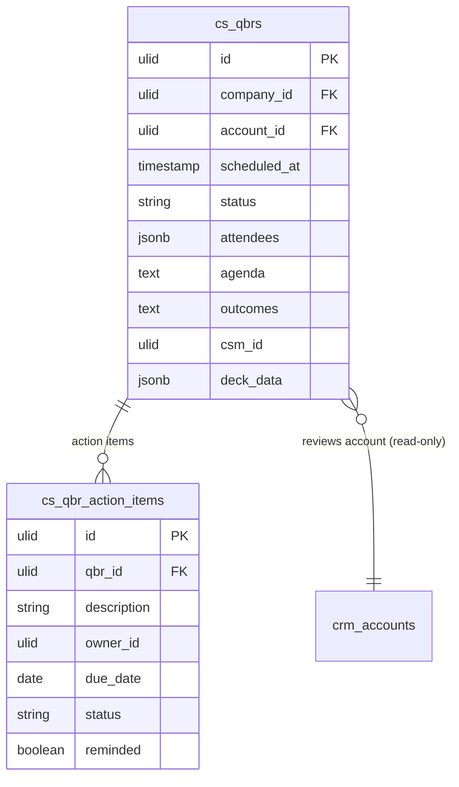

# QBR — Data Model

## cs_qbrs

| Column | Type | Constraints | Notes |
|---|---|---|---|
| id, company_id (indexed) | ulid | | |
| account_id | ulid | not null FK crm_accounts | read-only ref |
| scheduled_at | timestamp | not null | |
| status | string | not null | scheduled / held / cancelled |
| attendees | jsonb | default `[]` | names / contact refs |
| agenda | text | nullable | seeded from template default *(assumed)* |
| outcomes | text | nullable | required to mark held |
| csm_id | ulid | not null | CRM account owner *(assumed)* |
| deck_data | jsonb | default `{}` | snapshot of active-source metrics at prep time |
| deleted_at | timestamp | nullable | soft delete |

## cs_qbr_action_items

| Column | Type | Constraints | Notes |
|---|---|---|---|
| id, qbr_id (FK), company_id | ulid | | |
| description | string | not null | |
| owner_id | ulid | not null | assignee |
| due_date | date | not null | |
| status | string | not null | open / done |
| reminded | boolean | default false | overdue-reminder guard |

---

## ERD

`account_id` / `csm_id` / `owner_id` reference `crm_accounts` + user records as read-only foreign keys. `deck_data` is a self-owned snapshot — this module never writes cs.health, support, or CRM tables.
