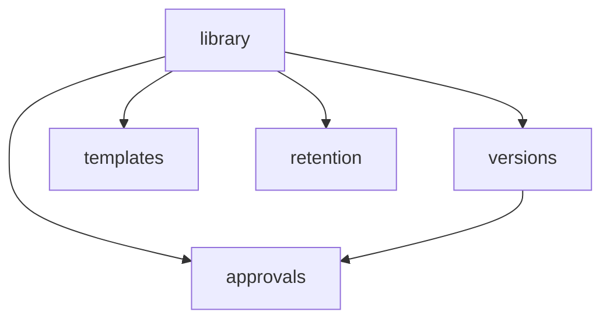

# Document Management

Document libraries, version control, approval workflows, retention policies, templates, and wiki pages. **Panel:** `/dms` (Slate) — Phase 2 (M9 in [[build/ROADMAP]]).

**Displaces**: Confluence, Notion (internal docs), SharePoint (SMB tier)

---

## Navigation Groups

- **Documents** — Document Library, Document Viewer
- **Wiki** — Wiki Pages
- **Approvals** — Approval Requests
- **Templates** — Document Templates
- **Settings** — Approval Workflows, Retention Policies, Legal Holds

---

## Modules

| Module | Key | Status | Priority | Depends on (intra-domain) |
|---|---|---|---|---|
| [[domains/dms/document-library\|Document Library]] | `dms.library` | planned | p2 | — (anchor) |
| [[domains/dms/version-control\|Version Control]] | `dms.versions` | planned | p2 | library |
| [[domains/dms/wiki\|Wiki Pages]] | `dms.wiki` | planned | p2 | — |
| [[domains/dms/templates\|Document Templates]] | `dms.templates` | planned | p2 | library |
| [[domains/dms/approval-workflows\|Approval Workflows]] | `dms.approvals` | planned | p2 | library |
| [[domains/dms/retention-policies\|Retention Policies]] | `dms.retention` | planned | p2 | library |

Build order: library → versions → wiki → templates → approvals → retention.

## Dependency Graph (intra-domain)



## Cross-Domain Edges

No domain events. Soft links: HR/CRM as template merge sources, core.privacy GDPR interplay (erasure overrides retention for person-files; legal holds win over policies).

---

## Status Board (Dataview)

```dataview
TABLE module-key AS "Key", status AS "Status", priority AS "Priority"
FROM "domains/dms"
WHERE type = "module"
SORT module-key ASC
```

---

## Key Patterns

- `spatie/laravel-media-library` — all file storage under `companies/{id}/dms/`
- `spatie/laravel-sluggable` — document + wiki slugs
- `awcodes/filament-tiptap-editor` — wiki pages, templates (purified)
- [[architecture/search]] — full-text document search, access-filtered
- `spatie/laravel-model-states` — approval status
- Custom pages — Document Library (folder tree #11), Wiki viewer, Document Viewer
- Folder access via single `accessibleFoldersFor()` scope — list, search, and viewer all use it
- [[architecture/data-lifecycle]] — retention floors + legal holds
