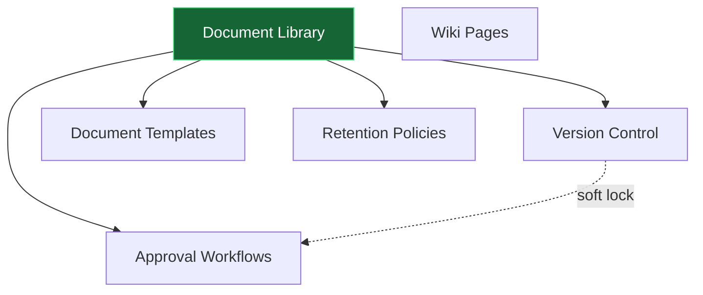

# Document Management

Folder-based document libraries, version control, approval chains, retention + legal holds, mail-merge templates, and an internal wiki. **Panel:** `/dms` (Slate) — Phase 2 (M9 in [[_archive/ROADMAP]]).

**Displaces**: Confluence, Notion (internal docs), SharePoint (SMB tier), DocuWare / M-Files (light records management).

> Every module below is now an exploded folder (`<slug>/_module.md` + architecture / data-model / api / security / decisions / unknowns / features). Statuses are uniform `planned` / `wip`. Full-mapping constitution: [[../../decisions/decision-2026-06-20-full-mapping-conventions]].

---

## Navigation Groups

- **Documents** — Document Library, Document Viewer, Version History
- **Wiki** — Wiki Pages, Wiki Viewer
- **Approvals** — Approval Requests, Approval Workflows
- **Templates** — Document Templates, Generate from Template
- **Settings** — Retention Policies, Legal Holds, Retention Log

---

## Modules

| Module | Key | Priority | Build status | Depends on (intra-domain) |
|---|---|---|---|---|
| [[document-library/_module\|Document Library]] | `dms.library` | p2 | planned | — (anchor) |
| [[version-control/_module\|Version Control]] | `dms.versions` | p2 | planned | library |
| [[wiki/_module\|Wiki Pages]] | `dms.wiki` | p2 | planned | — (standalone) |
| [[templates/_module\|Document Templates]] | `dms.templates` | p2 | planned | library |
| [[approval-workflows/_module\|Approval Workflows]] | `dms.approvals` | p2 | planned | library, versions (soft) |
| [[retention-policies/_module\|Retention Policies]] | `dms.retention` | p2 | planned | library |

Build order: **library → versions → wiki → templates → approvals → retention**.

## Dependency Graph (intra-domain)



Wiki is standalone — it degrades to nothing if the library is absent; the other four all layer on the library's documents.

## Cross-Domain Edges

| Direction | Event / API | Counterpart | Origin module |
|---|---|---|---|
| Commands | `core.files` Media Library + `CompanyPathGenerator` | core.files | library, versions, retention |
| Commands | `DocumentService::archive` / `::softDelete` | dms.library | retention (never writes `dms_documents` directly) |
| Commands | approver notifications + pre-deletion notices | core.notifications | approvals, retention |
| Reads | HR / CRM field providers (merge sources) | hr.profiles, crm.contacts | templates |
| Coordinates | GDPR erasure vs retention floors + legal holds | core.privacy | retention |
| Fires | *(none — DMS defines no cross-domain events in v1)* | — | all |

Payload contracts (if events are later added): [[../../architecture/event-bus]]. Ownership boundary: [[../../security/data-ownership]].

---

## Status Board (Dataview)

```dataview
TABLE module AS "Module", build-status AS "Build", status AS "Status"
FROM "domains/dms"
WHERE type = "module"
SORT module ASC
```

---

## Key Patterns

- `spatie/laravel-media-library` + `core.files` `CompanyPathGenerator` — all bytes under `companies/{id}/dms/`.
- `spatie/laravel-sluggable` — document + wiki slugs.
- `awcodes/filament-tiptap-editor` — wiki pages + templates (purified via `ezyang/htmlpurifier`).
- [[../../architecture/search]] — Meilisearch full-text, **access-filtered** (documents + wiki).
- `spatie/laravel-model-states` — approval status machine.
- `spatie/laravel-pdf` — branded PDF output from templates.
- Custom pages — Document Library tree (ui-strategy #11), Document Viewer, Wiki Viewer, Generate-from-Template wizard (#7).
- Single `accessibleFoldersFor()` / `accessiblePagesFor()` scope — list, search, and viewer all compose on it (no leak paths).
- [[../../architecture/data-lifecycle]] — retention floors + legal holds; erasure overrides retention for person-files.

## Opportunity Radar

Web-researched market gaps → candidate differentiators: [[_opportunities]].
