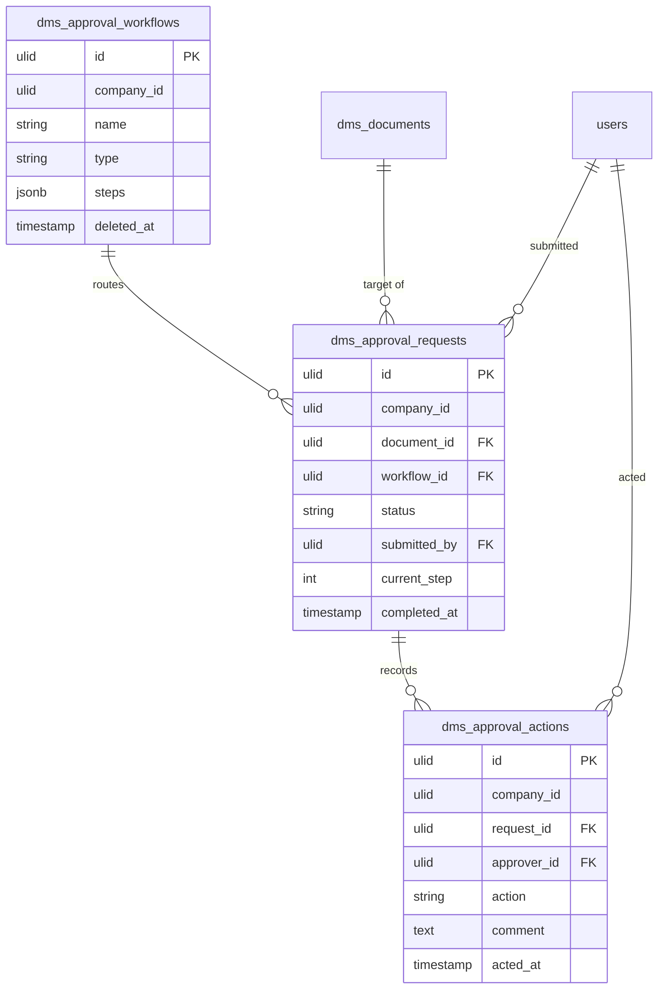

# Approval Workflows — Data Model

## `dms_approval_workflows`

| Column | Type | Notes |
|---|---|---|
| `id` | ulid | PK |
| `company_id` | ulid | Indexed, `BelongsToCompany` |
| `name` | string | |
| `type` | string | `sequential` / `parallel` |
| `steps` | jsonb | Ordered `[{ role_id? / user_id? }]` — each entry exactly one of role/user |
| `deleted_at` | timestamp nullable | `SoftDeletes` |

## `dms_approval_requests`

| Column | Type | Notes |
|---|---|---|
| `id` | ulid | PK |
| `company_id` | ulid | Indexed, `BelongsToCompany` |
| `document_id` | ulid | FK → `dms_documents` ([[../document-library/_module\|dms.library]]); one **open** request per document (partial unique) |
| `workflow_id` | ulid | FK → `dms_approval_workflows` |
| `status` | string | Default `pending`; state machine (`pending`/`in_review`/`approved`/`rejected`) |
| `submitted_by` | ulid | FK → `users` |
| `current_step` | int | Default `0`; sequential pointer |
| `completed_at` | timestamp nullable | Set on approve/reject |

## `dms_approval_actions`

| Column | Type | Notes |
|---|---|---|
| `id` | ulid | PK |
| `company_id` | ulid | Indexed, `BelongsToCompany` |
| `request_id` | ulid | FK → `dms_approval_requests` |
| `approver_id` | ulid | FK → `users` |
| `action` | string | `approved` / `rejected` / `changes` |
| `comment` | text nullable | Required on reject *(and on request-changes — see [[unknowns]])* |
| `acted_at` | timestamp | When the action was taken |

Append-only — action rows are never updated or deleted (audit trail).

## ERD

The `dms_documents` record is owned by [[../document-library/_module|dms.library]] — referenced by `dms_approval_requests.document_id`, never duplicated here. The document **lock** is a column in the [[../version-control/_module|dms.versions]] table, set/cleared by commanding that service, not written here.
