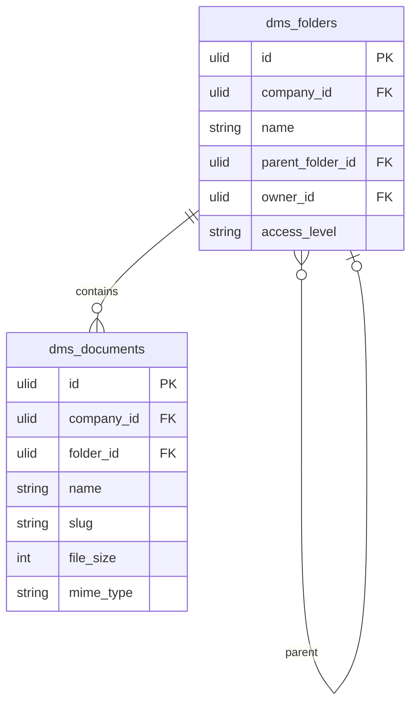

# Document Library

Folder-based document storage with search, preview, and access control. The core repository of the DMS domain.

## Core Features

- Folder tree: nested folders (parent_folder_id self-referential)
- Document record: name, folder, file (Media Library), description, tags, owner
- Upload any file type; preview PDFs, images, Office docs in-browser
- Full-text search across document names and extracted text content (Meilisearch)
- Folder-level access control: restrict folders to roles or users
- Document metadata: size, type, uploaded by, last modified
- Move/copy documents between folders
- Favourite/star documents
- Recent documents view
- Storage path always `companies/{company_id}/dms/` (see [[architecture/security]])

## Data Model

| Table | Key Columns |
|---|---|
| `dms_folders` | company_id, name, parent_folder_id, owner_id, access_level (all/restricted) |
| `dms_folder_access` | folder_id, company_id, role_id or user_id |
| `dms_documents` | company_id, folder_id, name, slug, description, owner_id, file_size, mime_type |

## Filament

**Nav group:** Documents

- `DocumentLibraryPage` (custom page) — folder tree sidebar + document grid (not a standard table)
- `DocumentViewerPage` (custom page) — in-browser preview
- Upload via drag-and-drop with Media Library

## Related

- [[domains/dms/version-control]]
- [[domains/dms/approval-workflows]]
- [[architecture/search]]
- [[domains/core/file-storage]]
