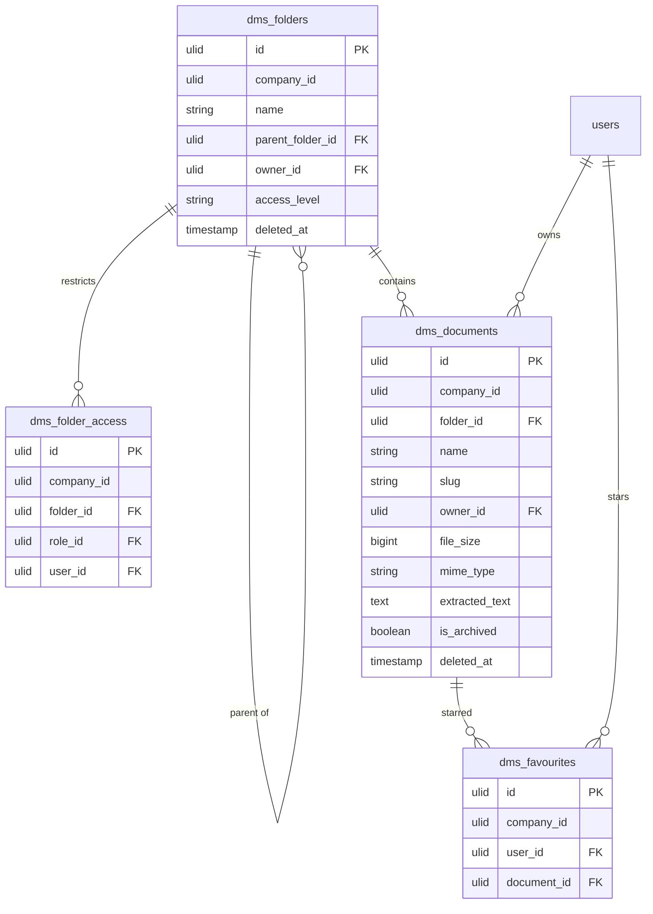

# Document Library — Data Model

## `dms_folders`

| Column | Type | Notes |
|---|---|---|
| `id` | ulid | PK |
| `company_id` | ulid | Indexed, `BelongsToCompany` |
| `name` | string | unique `(parent_folder_id, name)` *(assumed)* |
| `parent_folder_id` | ulid nullable | FK self, cycle-checked |
| `owner_id` | ulid | FK → `users` |
| `access_level` | string | `all` / `restricted`, default `all` |
| `deleted_at` | timestamp nullable | `SoftDeletes` |

## `dms_folder_access`

| Column | Type | Notes |
|---|---|---|
| `id` | ulid | PK |
| `company_id` | ulid | Indexed |
| `folder_id` | ulid | FK → `dms_folders` |
| `role_id` | ulid nullable | Exactly one of role/user set |
| `user_id` | ulid nullable | Exactly one of role/user set |

## `dms_documents`

| Column | Type | Notes |
|---|---|---|
| `id` | ulid | PK |
| `company_id` | ulid | Indexed, `BelongsToCompany` |
| `folder_id` | ulid | FK → `dms_folders` |
| `name` | string | |
| `slug` | string | `spatie/laravel-sluggable`, unique per company |
| `description` | text nullable | |
| `owner_id` | ulid | FK → `users` |
| `file_size` | bigint | bytes |
| `mime_type` | string | |
| `extracted_text` | text nullable | Meilisearch source |
| `is_archived` | boolean | default false; set by [[../retention-policies/_module\|retention]] |
| `deleted_at` | timestamp nullable | `SoftDeletes` |

**Indexes:** `(company_id, folder_id)`, `(company_id, owner_id)`.

## `dms_favourites`

*(assumed)* — `id`, `company_id`, `user_id` FK, `document_id` FK; unique `(user_id, document_id)`.

## ERD

The media/file record itself is owned by [[../../core/file-storage/_module|core.files]] (Media Library), referenced by `dms_documents`, never duplicated here.
