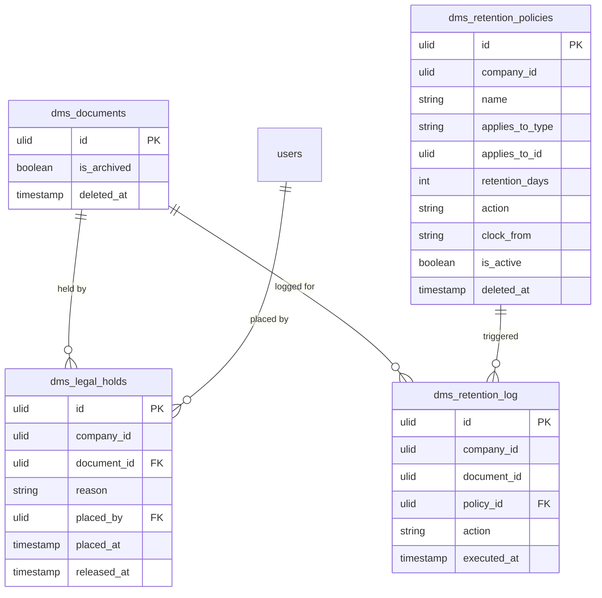

# Retention Policies — Data Model

Retention **owns** three tables. It acts on `dms_documents` (owned by [[../document-library/_module|dms.library]]) but never writes it directly — see [[decisions]].

## `dms_retention_policies`

| Column | Type | Notes |
|---|---|---|
| `id` | ulid | PK |
| `company_id` | ulid | Indexed, `BelongsToCompany` |
| `name` | string | |
| `applies_to_type` | string | `folder` / `tag` |
| `applies_to_id` | ulid nullable | folder id / tag id |
| `retention_days` | int | min 1 |
| `action` | string | `archive` / `delete` |
| `clock_from` | string | `created` / `modified` |
| `is_active` | boolean | default `true` |
| `deleted_at` | timestamp nullable | `SoftDeletes` |

## `dms_legal_holds`

| Column | Type | Notes |
|---|---|---|
| `id` | ulid | PK |
| `company_id` | ulid | Indexed, `BelongsToCompany` |
| `document_id` | ulid | FK → `dms_documents` (owned by `dms.library`) |
| `reason` | string | **required**, max 1000 |
| `placed_by` | ulid | FK → `users` |
| `placed_at` | timestamp | |
| `released_at` | timestamp nullable | null = active; **one active hold per document** |

## `dms_retention_log`

| Column | Type | Notes |
|---|---|---|
| `id` | ulid | PK |
| `company_id` | ulid | Indexed, `BelongsToCompany` |
| `document_id` | ulid | the document acted on |
| `policy_id` | ulid nullable | policy that triggered the action |
| `action` | string | `archived` / `soft-deleted` / `hard-deleted` / `notified` |
| `executed_at` | timestamp | |

**Append-only** — never updated or deleted; kept as compliance proof. The `(document_id, action)` pair is the idempotency guard for `ProcessRetentionCommand` re-runs.

## ERD

`dms_documents` is shown for context only — it is **owned by** [[../document-library/_module|dms.library]]. Retention reads it to find expired documents and commands `dms.library`'s `DocumentService` to set `is_archived` or soft/hard-delete; it never writes those columns itself ([[../../../security/data-ownership|data-ownership]]).
