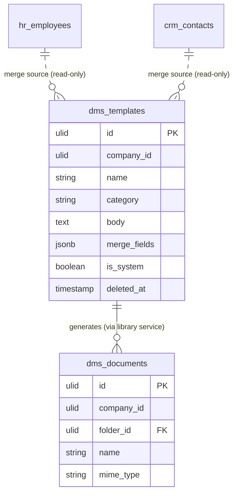

# Document Templates — Data Model

Templates owns exactly one table: `dms_templates`. Generated documents live in `dms_documents`, owned by [[../document-library/_module|dms.library]] and written only through its service.

## `dms_templates`

| Column | Type | Notes |
|---|---|---|
| `id` | ulid | PK |
| `company_id` | ulid | Indexed, `BelongsToCompany` |
| `name` | string | |
| `category` | string | `hr-contracts` / `legal` / `finance` / `general` |
| `body` | text | Purified rich text, `{{field}}` placeholders |
| `merge_fields` | jsonb | Declared fields + source hints |
| `is_system` | boolean | Seeded, read-only (copy-on-edit); default false |
| `deleted_at` | timestamp nullable | `SoftDeletes` |

**Indexes:** `(company_id, category)` *(assumed)*.

## ERD

The generated `dms_documents` row (and its media bytes) is created by `dms.library`'s `DocumentService::upload`, never written here. HR / CRM records are **read-only merge sources** resolved through their registered providers (whitelisted fields only) — no foreign key is stored ([[../../../security/data-ownership]]).
