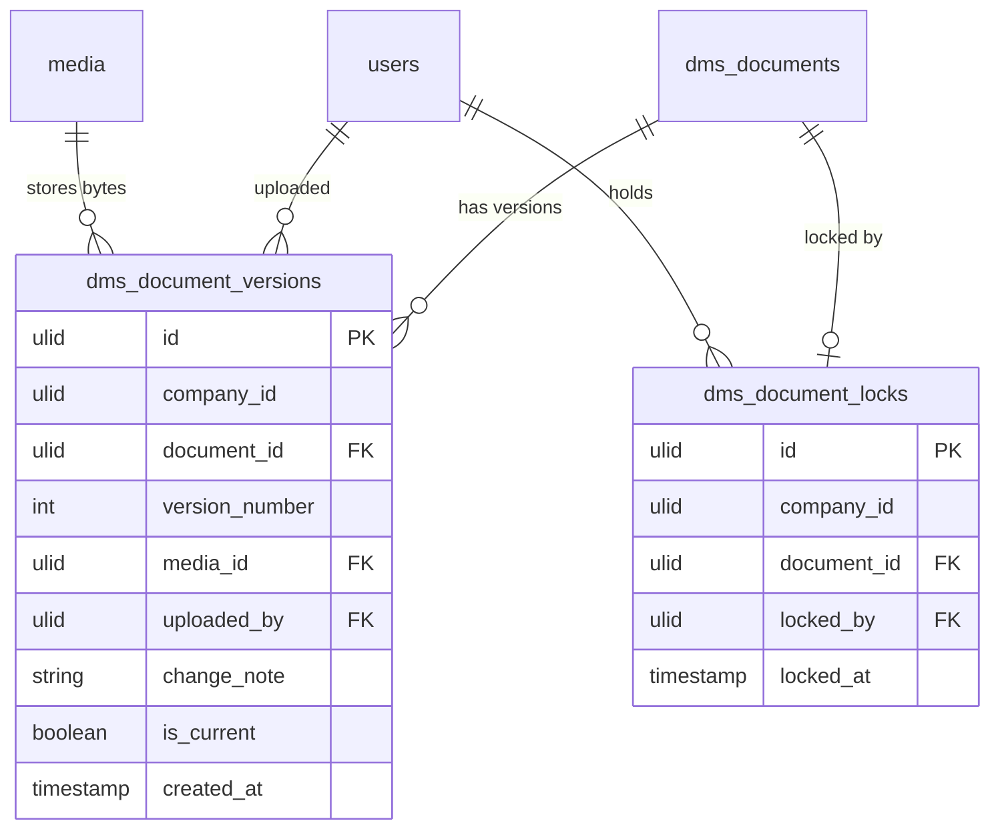

# Version Control — Data Model

## `dms_document_versions`

| Column | Type | Notes |
|---|---|---|
| `id` | ulid | PK |
| `company_id` | ulid | Indexed, `BelongsToCompany` |
| `document_id` | ulid | FK → `dms_documents` (owned by [[../document-library/_module\|dms.library]]) |
| `version_number` | int | Sequential; unique `(document_id, version_number)` |
| `media_id` | ulid | FK → media (owned by [[../../core/file-storage/_module\|core.files]]) |
| `uploaded_by` | ulid | FK → `users` |
| `change_note` | string nullable | Free-text note describing the change |
| `is_current` | boolean | Exactly one current per document — **partial unique** on `(document_id)` where `is_current` |
| `created_at` | timestamp | Upload date |

## `dms_document_locks`

| Column | Type | Notes |
|---|---|---|
| `id` | ulid | PK |
| `company_id` | ulid | Indexed, `BelongsToCompany` |
| `document_id` | ulid | FK → `dms_documents`; **unique** (one lock per document) |
| `locked_by` | ulid | FK → `users` |
| `locked_at` | timestamp | Auto-expires after 4h *(assumed)* — cleared by `ExpireStaleLocksCommand` |

## ERD

`dms_documents` (referenced by `document_id`) is owned by [[../document-library/_module|dms.library]]; the `media` record referenced by `media_id` is owned by [[../../core/file-storage/_module|core.files]] (Media Library). Neither is duplicated here — this module only owns `dms_document_versions` and `dms_document_locks`.
