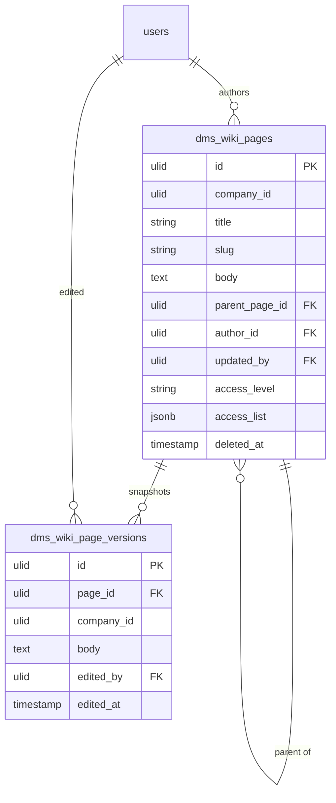

# Wiki — Data Model

## `dms_wiki_pages`

| Column | Type | Notes |
|---|---|---|
| `id` | ulid | PK |
| `company_id` | ulid | Indexed, `BelongsToCompany` |
| `title` | string | |
| `slug` | string | `spatie/laravel-sluggable`, unique per company |
| `body` | text | rich text, **purified** before storage |
| `parent_page_id` | ulid nullable | FK self, cycle-checked |
| `author_id` | ulid | FK → `users` |
| `updated_by` | ulid nullable | FK → `users` |
| `access_level` | string | `all` / `restricted`, default `all` |
| `access_list` | jsonb nullable | role/user ids (set when `restricted`) |
| `deleted_at` | timestamp nullable | `SoftDeletes` |

**Indexes:** `(company_id, parent_page_id)`, `(company_id, slug)` unique *(assumed)*.

## `dms_wiki_page_versions`

Append-only, capped 50 per page *(assumed)*.

| Column | Type | Notes |
|---|---|---|
| `id` | ulid | PK |
| `page_id` | ulid | FK → `dms_wiki_pages` |
| `company_id` | ulid | Indexed, `BelongsToCompany` |
| `body` | text | snapshot of the page body at save time |
| `edited_by` | ulid | FK → `users` |
| `edited_at` | timestamp | |

## ERD

> [!warning] UNVERIFIED
> Favourite pages are a stated core feature, but the source data model lists no favourites table. Whether wiki favourites reuse a shared `dms_favourites` table, get their own `dms_wiki_favourites` table, or store a per-user pivot is unspecified — see [[unknowns]].

Both tables are owned solely by `dms.wiki`; there is no shared table with, or FK into, the document library ([[../../../security/data-ownership]]).
