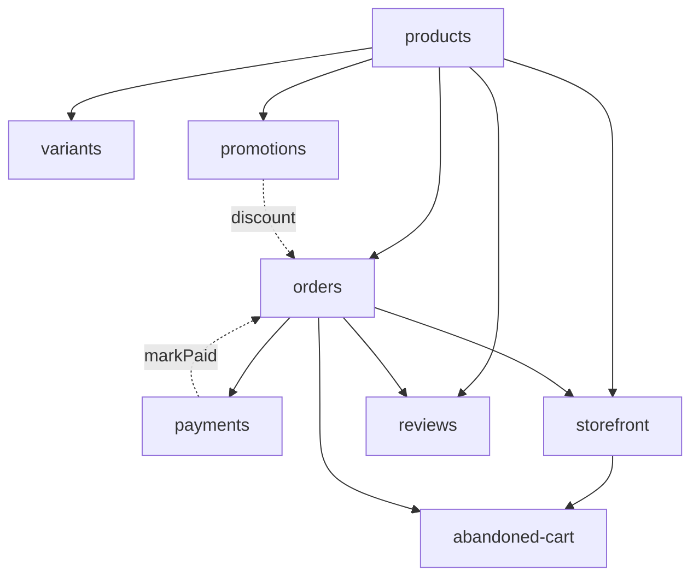
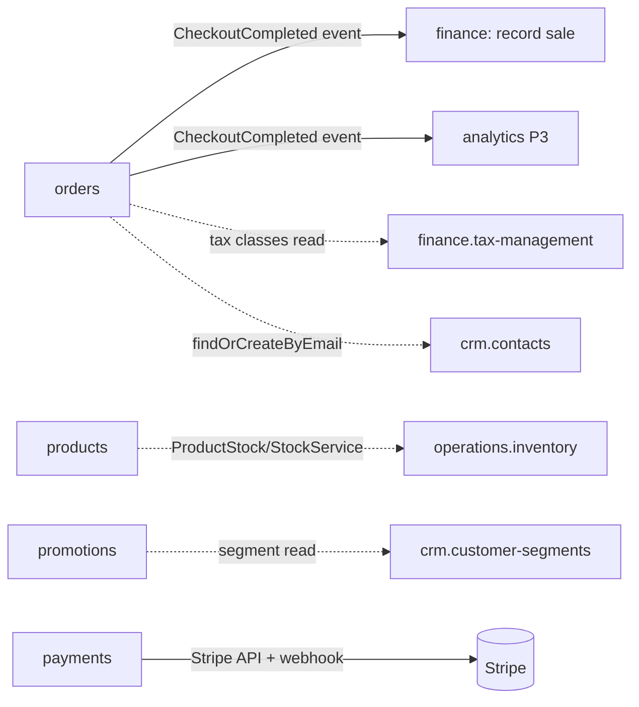

# E-commerce — MOC

Products, variants, orders, payments, promotions, reviews, storefront, and abandoned-cart recovery. **Panel:** `/ecommerce` (Teal) — Phase 3, priority p3. Every module is exploded to its folder (`_module` + architecture/data-model/api/security/decisions/unknowns + `features/`).

## Navigation Groups

- **Catalogue** — Products, Categories, Variants, Reviews
- **Orders** — Orders, Payments, Fulfilment (board)
- **Marketing** — Coupons, Promotions, Abandoned Carts
- **Settings** — Storefront configuration + content pages

## Modules

| Module | Key | Status | Intra-domain deps | Features |
|---|---|---|---|---|
| [[products/_module\|Product Catalogue]] | `ecommerce.products` | wip | — (anchor) | manage-catalogue, stock-linkage |
| [[variants/_module\|Product Variants]] | `ecommerce.variants` | wip | products | generate-variants |
| [[orders/_module\|Orders]] | `ecommerce.orders` | wip | products | place-order, fulfil-order |
| [[payments/_module\|Payments]] | `ecommerce.payments` | wip | orders | process-payment, refund |
| [[promotions/_module\|Promotions & Coupons]] | `ecommerce.promotions` | wip | products | manage-coupons, apply-discount |
| [[reviews/_module\|Product Reviews]] | `ecommerce.reviews` | wip | products, orders | submit-review, moderate-review |
| [[storefront/_module\|Storefront]] | `ecommerce.storefront` | wip | products, orders | browse-and-cart, checkout, configure-storefront |
| [[abandoned-cart/_module\|Abandoned Cart]] | `ecommerce.abandoned-cart` | wip | storefront, orders | recover-cart |

## Dependency Graph (intra-domain)

## Cross-Domain Edges

**Ownership boundary:** E-commerce writes only `ec_*` tables. The one write-effect into Finance is the `CheckoutCompleted` event — Finance's own listener writes finance tables; Orders never does. Stock is read/reserved through `operations.inventory`'s `StockService`. See [[../../security/data-ownership]].

## Key Patterns

- `spatie/laravel-model-states` — order status.
- `brick/money` — all totals/pricing; prices snapshot at order time.
- `stripe/stripe-php` raw SDK — payments (Connect vs per-company keys = build-time ADR).
- `spatie/laravel-sluggable` — product/category/page slugs.
- Storefront rendered via Vue + Inertia ([[../../frontend/_index]], ui-strategy row #16).
- Server re-validates the cart at every step — the client cart is never trusted.

## Related

- [[_opportunities|E-commerce Opportunities]] · [[../../architecture/event-bus]] · [[../../security/data-ownership]]
- [[../../architecture/patterns/feature-ui-spec]] · [[../../decisions/decision-2026-06-20-full-mapping-conventions]]
