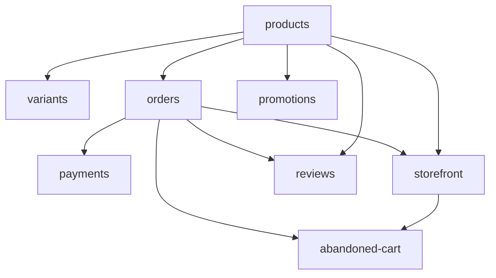

# E-commerce

Products, variants, orders, payments, promotions, reviews, abandoned cart recovery, and storefront. **Panel:** `/ecommerce` (Teal) — Phase 3.

---

## Navigation Groups

- **Catalogue** — Products, Categories, Variants, Reviews
- **Orders** — Orders, Payments, Fulfilment
- **Marketing** — Coupons, Promotions, Abandoned Carts
- **Settings** — Storefront Configuration

---

## Modules

| Module | Key | Status | Priority | Depends on (intra-domain) |
|---|---|---|---|---|
| [[domains/ecommerce/products\|Product Catalogue]] | `ecommerce.products` | planned | p3 | — (anchor) |
| [[domains/ecommerce/variants\|Product Variants]] | `ecommerce.variants` | planned | p3 | products |
| [[domains/ecommerce/orders\|Orders]] | `ecommerce.orders` | planned | p3 | products |
| [[domains/ecommerce/payments\|Payments]] | `ecommerce.payments` | planned | p3 | orders |
| [[domains/ecommerce/storefront\|Storefront]] | `ecommerce.storefront` | planned | p3 | products, orders |
| [[domains/ecommerce/promotions\|Promotions & Coupons]] | `ecommerce.promotions` | planned | p3 | products |
| [[domains/ecommerce/reviews\|Product Reviews]] | `ecommerce.reviews` | planned | p3 | products, orders |
| [[domains/ecommerce/abandoned-cart\|Abandoned Cart]] | `ecommerce.abandoned-cart` | planned | p3 | storefront, orders |

## Dependency Graph (intra-domain)



## Cross-Domain Edges

| Direction | Event | Counterpart |
|---|---|---|
| Fires | `CheckoutCompleted` (orders) | Finance (record sale), Analytics (P3) |

`CartAbandoned` event from v1 specs dropped (recovery is same-domain). Stock via `ProductStock` → `StockService` when operations active. Payload contract: [[architecture/event-bus]].

---

## Status Board (Dataview)

```dataview
TABLE module-key AS "Key", status AS "Status", priority AS "Priority"
FROM "domains/ecommerce"
WHERE type = "module"
SORT module-key ASC
```

---

## Key Patterns

- `spatie/laravel-model-states` — order status
- `brick/money` — all totals/pricing; prices snapshot at order time
- `stripe/stripe-php` raw SDK — payments (Connect vs per-company keys = build-time ADR)
- `spatie/laravel-sluggable` — product/category/page slugs
- Storefront rendered via Vue + Inertia ([[frontend/_index]], ui-strategy row #16)
- Server re-validates cart at every step — client cart is never trusted
