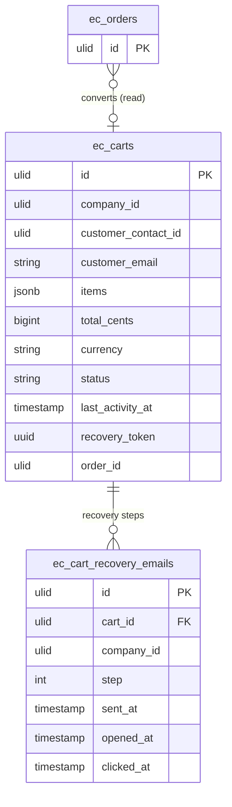

# Abandoned Cart — Data Model

Owns `ec_carts` + `ec_cart_recovery_emails`.

## `ec_carts`

| Column | Type | Notes |
|---|---|---|
| `id` | ulid | PK |
| `company_id` | ulid | Indexed, `BelongsToCompany` |
| `customer_contact_id` | ulid nullable | crm.contacts |
| `customer_email` | string | |
| `items` | jsonb | snapshot |
| `total_cents` | bigint | |
| `currency` | string(3) | |
| `status` | string default `active` | active/abandoned/recovered/converted |
| `last_activity_at` | timestamp | drives detection |
| `recovery_token` | uuid | unique — signed restore link |
| `order_id` | ulid nullable | conversion link |

## `ec_cart_recovery_emails`

| Column | Type | Notes |
|---|---|---|
| `id` | ulid | PK |
| `cart_id` | ulid | FK → `ec_carts` |
| `company_id` | ulid | Indexed |
| `step` | int | 1–3, unique per cart |
| `sent_at` | timestamp | |
| `opened_at` / `clicked_at` | timestamp nullable | |

**Unique:** `(cart_id, step)`, `(recovery_token)`.

## ERD

