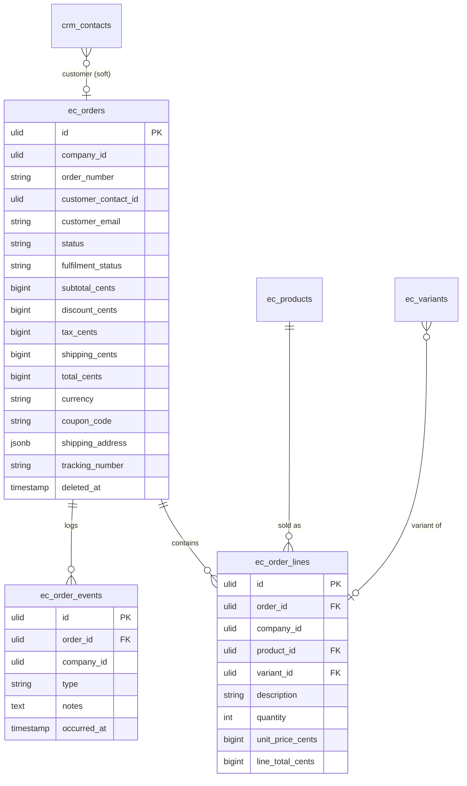

# Orders — Data Model

Owns `ec_orders` + `ec_order_lines` + `ec_order_events`. Never writes finance tables ([[../../../../security/data-ownership]]).

## `ec_orders`

| Column | Type | Notes |
|---|---|---|
| `id` | ulid | PK |
| `company_id` | ulid | Indexed, `BelongsToCompany` |
| `order_number` | string | unique per company |
| `customer_contact_id` | ulid nullable | CRM link (soft) |
| `customer_email` | string | snapshot |
| `customer_name` | string | snapshot |
| `status` | string default `pending` | state machine |
| `fulfilment_status` | string default `unfulfilled` | unfulfilled/partial/fulfilled |
| `subtotal_cents` / `discount_cents` / `tax_cents` / `shipping_cents` / `total_cents` | bigint | minor units |
| `currency` | string(3) | |
| `coupon_code` | string nullable | |
| `shipping_address` | jsonb nullable | |
| `tracking_number` | string nullable | |
| `deleted_at` | timestamp nullable | kept 7y per [[../../../../architecture/data-lifecycle]] |

**Indexes:** `(company_id, status)`, `(company_id, customer_email)`, unique `(company_id, order_number)`.

## `ec_order_lines`

| Column | Type | Notes |
|---|---|---|
| `id` | ulid | PK |
| `order_id` | ulid | FK → `ec_orders` |
| `company_id` | ulid | Indexed |
| `product_id` | ulid | FK → `ec_products` |
| `variant_id` | ulid nullable | FK → `ec_variants` |
| `description` | string | snapshot |
| `quantity` | int | `> 0` |
| `unit_price_cents` | bigint | snapshot |
| `line_total_cents` | bigint | snapshot |

## `ec_order_events` (append-only timeline)

| Column | Type | Notes |
|---|---|---|
| `id` | ulid | PK |
| `order_id` | ulid | FK → `ec_orders` |
| `company_id` | ulid | Indexed |
| `type` | string | placed/paid/fulfilled/cancelled/refunded/note |
| `notes` | text nullable | |
| `occurred_at` | timestamp | |

## ERD

