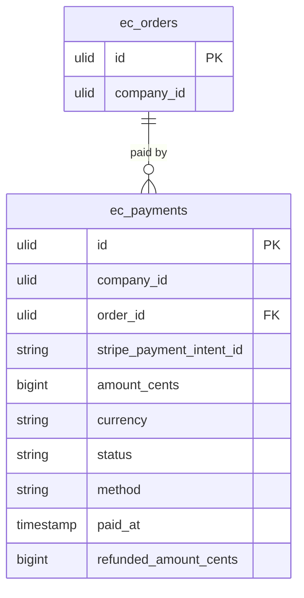

# Payments — Data Model

Owns `ec_payments`. No card data stored locally — only Stripe references.

## `ec_payments`

| Column | Type | Notes |
|---|---|---|
| `id` | ulid | PK |
| `company_id` | ulid | Indexed, `BelongsToCompany` |
| `order_id` | ulid | FK → `ec_orders` |
| `stripe_payment_intent_id` | string | unique |
| `amount_cents` | bigint | minor units |
| `currency` | string(3) | |
| `status` | string | pending / succeeded / failed |
| `method` | string nullable | card / ideal / sepa |
| `paid_at` | timestamp nullable | |
| `refunded_amount_cents` | bigint default 0 | ≤ `amount_cents`, cumulative |
| `created_at` / `updated_at` | timestamps | |

**Indexes:** `(company_id, order_id)`, unique `(stripe_payment_intent_id)`.

## ERD

