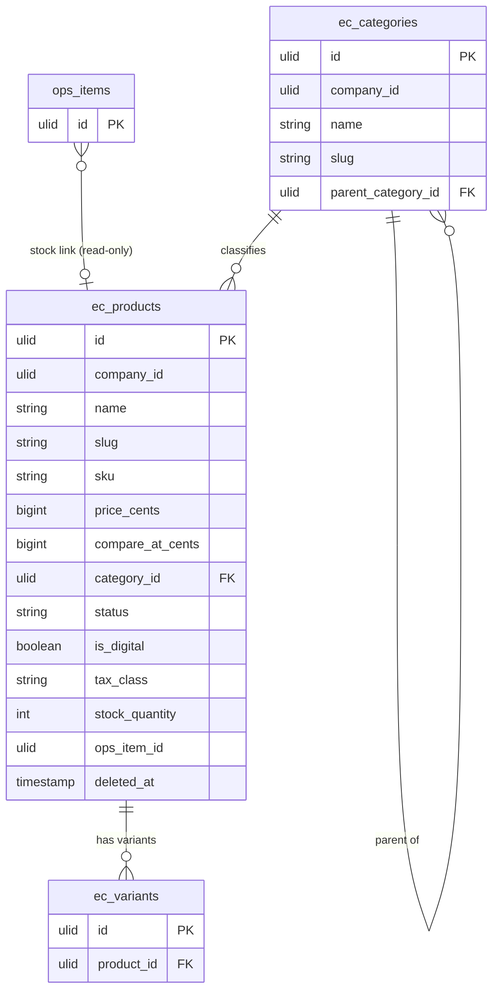

# Products — Data Model

Owns `ec_products` + `ec_categories`. No other module writes these ([[../../../../security/data-ownership]]).

## `ec_products`

| Column | Type | Notes |
|---|---|---|
| `id` | ulid | PK |
| `company_id` | ulid | Indexed, `BelongsToCompany` |
| `name` | string | |
| `slug` | string | unique per company (`spatie/laravel-sluggable`) |
| `description` | text | purified (htmlpurifier) |
| `sku` | string | unique per company |
| `price_cents` | bigint | minor units (`brick/money`) |
| `compare_at_cents` | bigint nullable | must exceed `price_cents` when set |
| `category_id` | ulid nullable | FK → `ec_categories` |
| `status` | string default `draft` | draft / active / archived |
| `is_digital` | boolean default false | skips fulfilment/shipping |
| `tax_class` | string nullable | label read from finance.tax |
| `stock_quantity` | int nullable | internal stock when no ops link |
| `ops_item_id` | ulid nullable | operations.inventory link |
| `meta_title` | string nullable | SEO |
| `meta_description` | string nullable | SEO |
| `created_at` / `updated_at` | timestamps | |
| `deleted_at` | timestamp nullable | `SoftDeletes` |

**Indexes:** `(company_id, status)`, unique `(company_id, slug)`, unique `(company_id, sku)`.

## `ec_categories`

| Column | Type | Notes |
|---|---|---|
| `id` | ulid | PK |
| `company_id` | ulid | Indexed |
| `name` | string | |
| `slug` | string | unique per company |
| `parent_category_id` | ulid nullable | FK → `ec_categories`; cycle-checked |
| `deleted_at` | timestamp nullable | `SoftDeletes` |

## ERD

