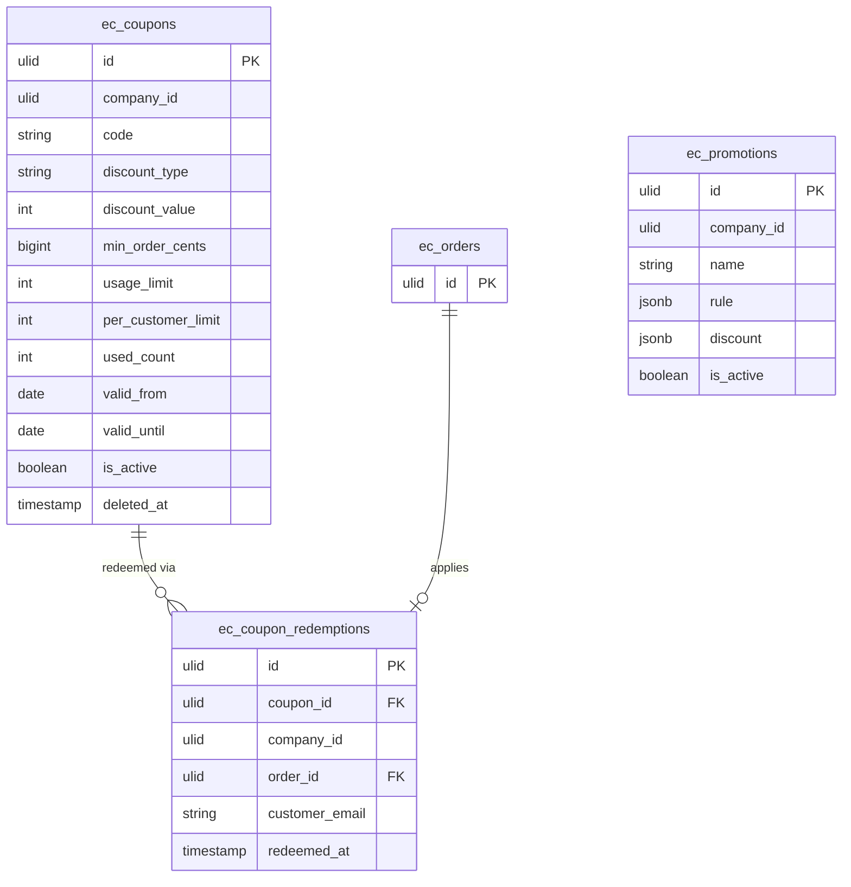

# Promotions — Data Model

Owns `ec_coupons` + `ec_promotions` + `ec_coupon_redemptions`.

## `ec_coupons`

| Column | Type | Notes |
|---|---|---|
| `id` | ulid | PK |
| `company_id` | ulid | Indexed, `BelongsToCompany` |
| `code` | string | unique per company, case-insensitive |
| `discount_type` | string | percent / fixed |
| `discount_value` | int | basis points (percent) or cents (fixed) |
| `min_order_cents` | bigint nullable | |
| `usage_limit` | int nullable | total uses |
| `per_customer_limit` | int nullable | |
| `used_count` | int default 0 | atomic increment |
| `valid_from` / `valid_until` | date nullable | |
| `is_active` | boolean | |
| `deleted_at` | timestamp nullable | `SoftDeletes` |

**Unique:** `(company_id, lower(code))`.

## `ec_promotions`

| Column | Type | Notes |
|---|---|---|
| `id`, `company_id` | ulid | Indexed |
| `name` | string | |
| `rule` | jsonb | registry-validated |
| `discount` | jsonb | |
| `valid_from` / `valid_until` | date nullable | |
| `is_active` | boolean | |

## `ec_coupon_redemptions`

| Column | Type | Notes |
|---|---|---|
| `id` | ulid | PK |
| `coupon_id` | ulid | FK → `ec_coupons` |
| `company_id` | ulid | Indexed |
| `order_id` | ulid | FK → `ec_orders` |
| `customer_email` | string | for per-customer limit |
| `redeemed_at` | timestamp | |

## ERD

