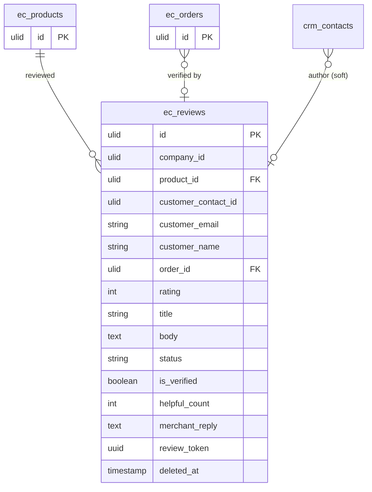

# Reviews — Data Model

Owns `ec_reviews`.

## `ec_reviews`

| Column | Type | Notes |
|---|---|---|
| `id` | ulid | PK |
| `company_id` | ulid | Indexed, `BelongsToCompany` |
| `product_id` | ulid | FK → `ec_products` |
| `customer_contact_id` | ulid nullable | crm.contacts link |
| `customer_email` | string | |
| `customer_name` | string | |
| `order_id` | ulid nullable | verified link; unique `(order_id, product_id)` |
| `rating` | int | 1–5 |
| `title` | string | purified |
| `body` | text | purified |
| `status` | string default `pending` | pending / approved / rejected |
| `is_verified` | boolean | order-linked |
| `helpful_count` | int default 0 | |
| `merchant_reply` | text nullable | purified |
| `review_token` | uuid | unique — request-mail link |
| `deleted_at` | timestamp nullable | `SoftDeletes` |

**Unique:** `(order_id, product_id)`, `(review_token)`.

## ERD

