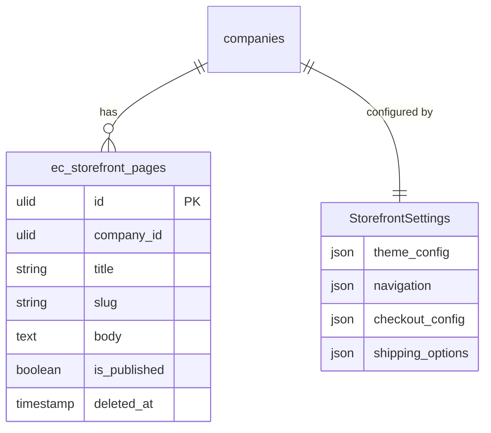

# Storefront — Data Model

Owns `ec_storefront_pages` and the `StorefrontSettings` (spatie/laravel-settings) bag. Cart state is session-based (see [[../../abandoned-cart/_module|Abandoned Cart]] for the persisted `ec_carts` capture).

## `ec_storefront_pages`

| Column | Type | Notes |
|---|---|---|
| `id` | ulid | PK |
| `company_id` | ulid | Indexed, `BelongsToCompany` |
| `title` | string | |
| `slug` | string | unique per company |
| `body` | text | purified |
| `is_published` | boolean | only published shown publicly |
| `deleted_at` | timestamp nullable | `SoftDeletes` |

## `StorefrontSettings` (settings bag, not a table)

- `theme_config` (name, logo, colours, currency, languages)
- `navigation` (menu tree of categories + pages)
- `checkout_config` (required fields, guest toggle, terms)
- `shipping_options` (flat rate, free-over threshold)

## ERD

