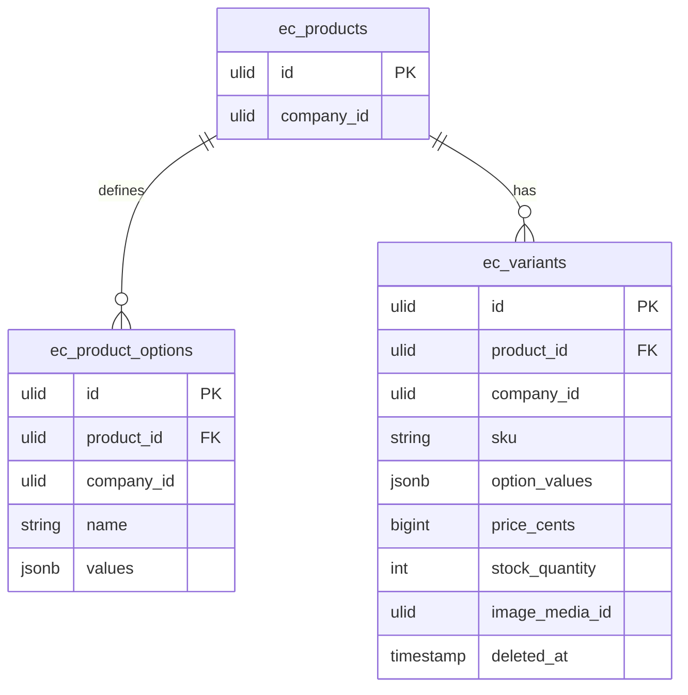

# Variants — Data Model

Owns `ec_product_options` + `ec_variants`.

## `ec_product_options`

| Column | Type | Notes |
|---|---|---|
| `id` | ulid | PK |
| `product_id` | ulid | FK → `ec_products` |
| `company_id` | ulid | Indexed |
| `name` | string | e.g. Size, Colour |
| `values` | jsonb | array of option values |

**Unique:** `(product_id, name)`. Max 3 option rows per product *(assumed)*.

## `ec_variants`

| Column | Type | Notes |
|---|---|---|
| `id` | ulid | PK |
| `product_id` | ulid | FK → `ec_products` |
| `company_id` | ulid | Indexed |
| `sku` | string | unique per company |
| `option_values` | jsonb | `{Size: "L", Colour: "Red"}` — unique combination per product |
| `price_cents` | bigint nullable | null = product price |
| `stock_quantity` | int default 0 | internal, or ops link via product |
| `image_media_id` | ulid nullable | |
| `deleted_at` | timestamp nullable | `SoftDeletes` |

**Unique:** `(product_id, option_values)`, `(company_id, sku)`.

## ERD

