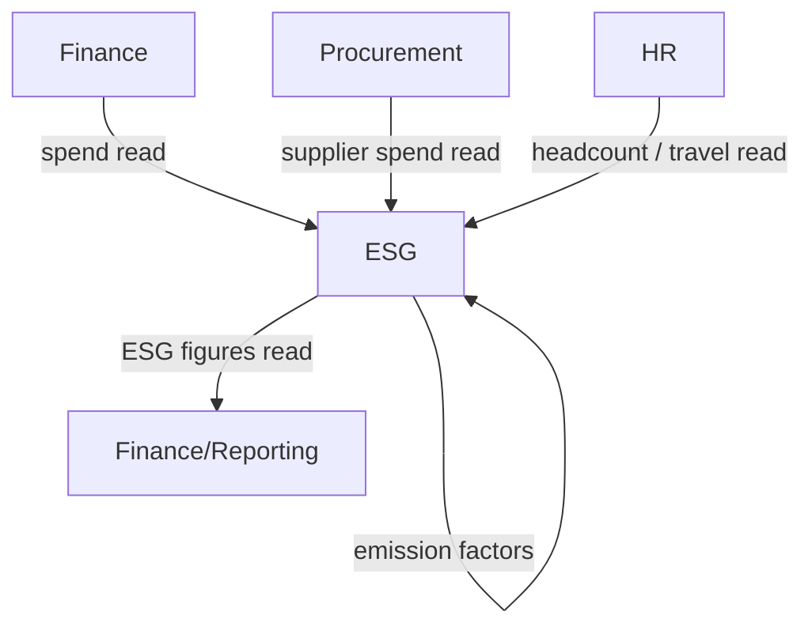

# ESG & Sustainability

Carbon accounting, ESG KPI tracking, and disclosure reporting (CSRD / GHG Protocol) sized for SMEs —
the tier priced out of Watershed / Persefoni / Workiva. Pulls activity data from the rest of the suite
(procurement spend, travel, facilities) so footprint is computed, not hand-entered.

**Why deferred:** compliance-driven demand is real but lumpy; build fully when a customer hits a CSRD
or supply-chain reporting trigger. Targeted for Phase 3.

## Intended Modules *(assumed — no prior spec)*

| Module | Key | One-line purpose | UI kind guess |
|---|---|---|---|
| Emissions Inventory | esg.emissions | Scope 1/2/3 activity data → CO2e via factor library | custom Filament page + resource |
| Emission Factors | esg.factors | Shared reference library of emission factors | Filament resource (reference) |
| ESG KPIs & Metrics | esg.kpis | Environmental/social/governance metric definitions + values | Filament resource + widgets |
| Disclosure Reports | esg.reports | CSRD / GRI / GHG report builder, review, publish | custom Filament page (builder) |
| Targets & Reduction | esg.targets | Reduction targets, trajectory, progress tracking | Filament resource + chart widget |
| Supplier Sustainability | esg.suppliers | Supplier ESG ratings / questionnaires (Scope 3) | Filament resource (reads Procurement) |
| Assurance & Audit Trail | esg.assurance | Evidence, data lineage, auditor access for limited assurance | custom Filament page |
| Dashboard | esg.dashboard | Company sustainability overview | Filament dashboard + widgets |

## Cross-Domain Relations

| Direction | Counterpart domain | Coupling |
|---|---|---|
| consumes | Finance | read (spend-based emissions) |
| consumes | Procurement | read (supplier spend, goods) + event |
| consumes | HR | read (headcount, commute/travel) |
| consumes | Core | read (settings, files, audit) |
| feeds | Finance/Reporting | read (ESG figures in annual report) |

Full explosion into module/feature notes (with per-feature `## UI` + `## Relations`) happens when this
domain leaves `build-status: deferred`.
