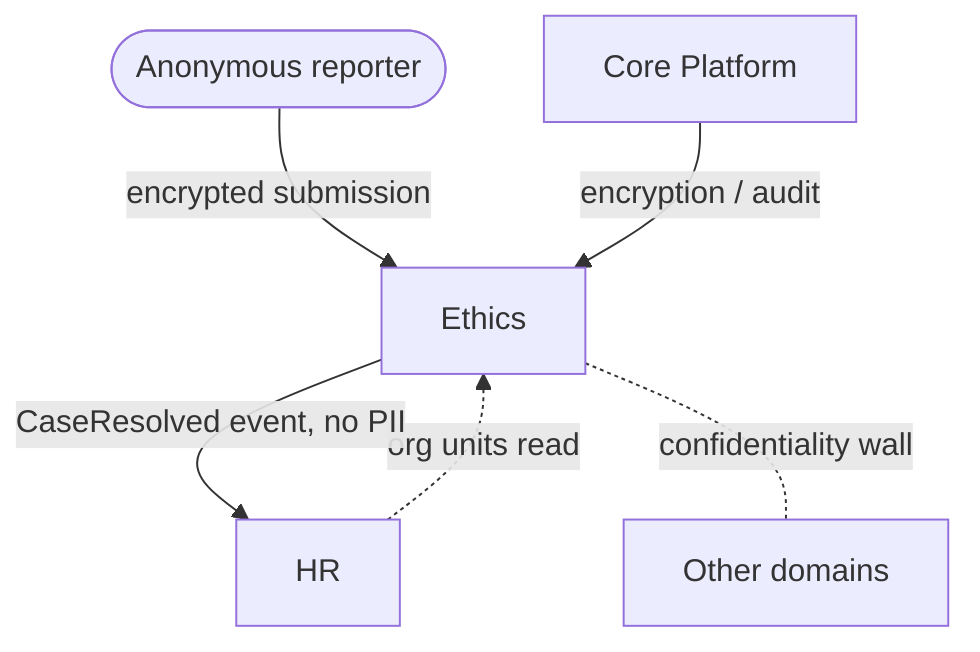

# Whistleblowing & Ethics

Anonymous reporting channel, case management, and disclosure workflow to satisfy the EU Whistleblower
Directive (mandatory for 50+ employee companies). Replaces NavEx / Whispli / EQS at the SMB tier, with
strict anonymity and a hard confidentiality wall from the rest of the tenant.

**Why deferred:** clear compliance trigger but only bites for regulated / EU 50+ headcount customers;
build fully when such a customer requests it. Confidentiality design must be reviewed with Security first.

## Intended Modules *(assumed — no prior spec)*

| Module | Key | One-line purpose | UI kind guess |
|---|---|---|---|
| Intake Channel | ethics.intake | Anonymous report submission (web form, multi-language) | Vue/Inertia (public portal) |
| Case Management | ethics.cases | Triage, investigate, status workflow, deadlines | custom Filament page (case board) |
| Anonymous Messaging | ethics.messaging | Two-way anonymous dialogue with reporter | custom Filament page (thread) |
| Disclosure Workflow | ethics.disclosure | Acknowledge (7d) / feedback (3mo) directive timers | Filament resource + background |
| Investigators & Roles | ethics.investigators | Restricted case-handler assignment, conflict checks | Filament resource |
| Evidence Vault | ethics.evidence | Encrypted attachments, chain of custody | custom Filament page |
| Compliance Reporting | ethics.reports | Directive-compliant stats + audit export | Filament resource + widget |
| Policy & Categories | ethics.policy | Report categories, code-of-conduct policies | Filament resource (reference) |

## Cross-Domain Relations

| Direction | Counterpart domain | Coupling |
|---|---|---|
| consumes | Core (identity, encryption, audit, notifications) | read + event |
| consumes | HR | read only (org units for routing) — never write |
| feeds | HR | event (case-resolved signal, no PII) |
| isolated | all others | confidentiality wall — no cross-domain reads of case content |

Full explosion into module/feature notes (with per-feature `## UI` + `## Relations`) happens when this
domain leaves `build-status: deferred`. Confidentiality + anonymity is the dominant design constraint.
