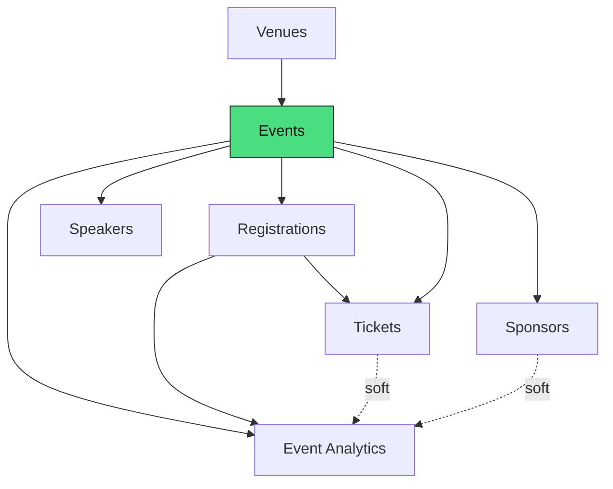
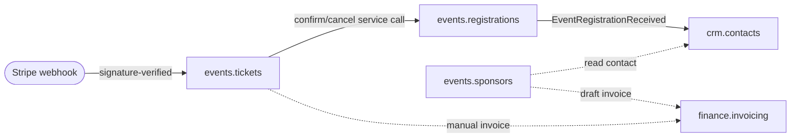

# Events Management — MOC

Events, registrations, tickets, speakers, sponsors, venues, and analytics. **Panel:** `/events` (Rose) — Phase 3. **Displaces:** Eventbrite, Cvent, Hopin (SMB).

Fully mapped to the feature level per [[../../decisions/decision-2026-06-20-full-mapping-conventions]]. Every module owns its tables; cross-domain effects are events or read-only service calls ([[../../security/data-ownership]]).

---

## Modules

| Module | Key | Owns tables | Public surface | Fires |
|---|---|---|---|---|
| [[events/_module\|Events]] | `events.events` | `ev_events`, `ev_sessions` | landing (Vue) | — |
| [[registrations/_module\|Registrations]] | `events.registrations` | `ev_registrations` | registration form (Vue) | `EventRegistrationReceived` |
| [[tickets/_module\|Tickets]] | `events.tickets` | `ev_tickets`, `ev_ticket_purchases`, `ev_ticket_discounts` | purchase (Vue+Stripe) | — |
| [[speakers/_module\|Speakers]] | `events.speakers` | `ev_speakers`, `ev_session_speakers` | submit + profiles (Vue) | — |
| [[sponsors/_module\|Sponsors]] | `events.sponsors` | `ev_sponsors`, `ev_sponsor_deliverables` | logos on landing | — |
| [[venues/_module\|Venues]] | `events.venues` | `ev_venues`, `ev_venue_rooms` | address on landing | — |
| [[event-analytics/_module\|Event Analytics]] | `events.analytics` | *(none — read-only)* | — | — |

## Intra-domain dependency graph



## Cross-domain edges



| Direction | Event / API | Counterpart |
|---|---|---|
| Fires | `EventRegistrationReceived` | crm.contacts (find-or-create) |
| Command | `RegistrationService::confirm/cancel` | tickets → registrations (same-domain) |
| Reads | CRM contact (`contact_id`) | sponsors → crm.contacts |
| Command | draft invoice (`fin_invoice_id`) | sponsors / tickets → finance.invoicing (soft) |

Payload contracts: [[../../architecture/event-bus]]. Ownership rule: [[../../security/data-ownership]].

---

## Navigation Groups (panel)

- **Events** — Events, Event Calendar, Agenda, Check-In
- **Registrations** — Registrations, Tickets
- **Speakers** — Speakers
- **Sponsors** — Sponsors
- **Analytics** — Event Dashboard
- **Settings** — Venues

## Key Patterns

- `saade/filament-fullcalendar` — event calendar · `spatie/laravel-model-states` — event + registration status
- `spatie/laravel-pdf` + `simplesoftwareio/simple-qrcode` — tickets with QR · `spatie/icalendar-generator` — `.ics` invites
- `brick/money` + `stripe/stripe-php` — paid tickets (atomic oversell protection, signature-verified webhook)
- Public landing/registration via Vue + Inertia ([[../../frontend/_index]]), rate-limited

## Status Board (Dataview)

```dataview
TABLE module AS "Module", build-status AS "Build", status AS "Status"
FROM "domains/events"
WHERE type = "module"
SORT module ASC
```

---

## Related

- [[_opportunities|Events — Opportunities]] (competitor gaps)
- [[../../security/data-ownership]] · [[../../architecture/patterns/feature-ui-spec]] · [[../../architecture/event-bus]]
- [[../_overview|Domains overview]]
