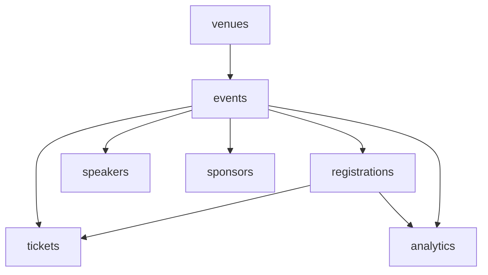

# Events Management

Events, registrations, tickets, speakers, sponsors, venues, and analytics. **Panel:** `/events` (Rose) — Phase 3.

**Displaces**: Eventbrite, Hopin, BigMarker (SMB)

---

## Navigation Groups

- **Events** — Events, Event Calendar, Sessions, Check-In
- **Registrations** — Registrations, Tickets
- **People** — Speakers, Sponsors
- **Analytics** — Event Dashboard
- **Settings** — Venues

---

## Modules

| Module | Key | Status | Priority | Depends on (intra-domain) |
|---|---|---|---|---|
| [[domains/events/events\|Events]] | `events.events` | planned | p3 | — (anchor) |
| [[domains/events/registrations\|Registrations]] | `events.registrations` | planned | p3 | events |
| [[domains/events/tickets\|Tickets]] | `events.tickets` | planned | p3 | events, registrations |
| [[domains/events/speakers\|Speakers]] | `events.speakers` | planned | p3 | events |
| [[domains/events/sponsors\|Sponsors]] | `events.sponsors` | planned | p3 | events |
| [[domains/events/venues\|Venues]] | `events.venues` | planned | p3 | — |
| [[domains/events/event-analytics\|Event Analytics]] | `events.analytics` | planned | p3 | events, registrations |

## Dependency Graph (intra-domain)



## Cross-Domain Edges

| Direction | Event | Counterpart |
|---|---|---|
| Fires | `EventRegistrationReceived` (registrations) | crm.contacts find-or-create |

Sponsor/ticket revenue → Finance via manual invoice actions (v1). Payload contract: [[architecture/event-bus]].

---

## Status Board (Dataview)

```dataview
TABLE module-key AS "Key", status AS "Status", priority AS "Priority"
FROM "domains/events"
WHERE type = "module"
SORT module-key ASC
```

---

## Key Patterns

- `saade/filament-fullcalendar` — event calendar
- `spatie/laravel-model-states` — event status, registration status
- `spatie/laravel-pdf` + `simplesoftwareio/simple-qrcode` — tickets with QR
- `spatie/icalendar-generator` — `.ics` invites on confirmation
- `brick/money` + `stripe/stripe-php` — paid tickets (atomic oversell protection)
- Public landing/registration pages via Vue + Inertia ([[frontend/_index]]), rate-limited
