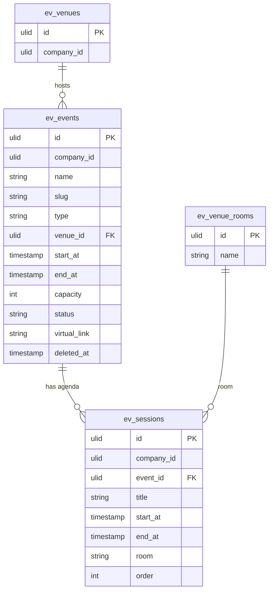

# Events — Data Model

## `ev_events`

| Column | Type | Notes |
|---|---|---|
| `id` | ulid | PK |
| `company_id` | ulid | Indexed, `BelongsToCompany` |
| `name` | string | |
| `slug` | string | Unique per company (`spatie/laravel-sluggable`) |
| `description` | text | HTMLPurifier-sanitized |
| `type` | string | in-person / virtual / hybrid |
| `venue_id` | ulid nullable | FK → `ev_venues` (in-person/hybrid) |
| `start_at` | timestamp | |
| `end_at` | timestamp | Must be after `start_at` |
| `capacity` | int nullable | null = unlimited |
| `status` | string | default `draft`; state machine |
| `virtual_link` | string nullable | Revealed to confirmed registrants only |
| `created_at` / `updated_at` | timestamps | |
| `deleted_at` | timestamp nullable | `SoftDeletes` |

**Indexes:** `(company_id, status)`, `(company_id, slug)` unique.

## `ev_sessions`

| Column | Type | Notes |
|---|---|---|
| `id` | ulid | PK |
| `company_id` | ulid | Indexed |
| `event_id` | ulid | FK → `ev_events` |
| `title` | string | |
| `start_at` / `end_at` | timestamp | Must fall within the event window |
| `room` | string nullable | Drawn from the venue's rooms *(assumed: free-text or `ev_venue_rooms.name`)* |
| `order` | int | Agenda display order |

## ERD

> Note: `ev_venues` / `ev_venue_rooms` are owned by [[../venues/_module|events.venues]] and shown here only for the FK relationship.
