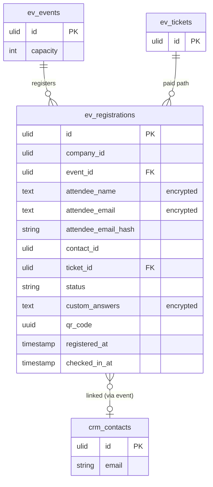

# Registrations — Data Model

## `ev_registrations`

| Column | Type | Notes |
|---|---|---|
| `id` | ulid | PK |
| `company_id` | ulid | Indexed, `BelongsToCompany` |
| `event_id` | ulid | FK → `ev_events` |
| 🔐 `attendee_name` | text | Encrypted cast — external attendee PII |
| 🔐 `attendee_email` | text | Encrypted cast — external attendee PII |
| `attendee_email_hash` | string | Indexed; `sha256(attendee_email)` — backs unique `(event_id, attendee_email_hash)` since encrypted email isn't queryable |
| `contact_id` | ulid nullable | CRM link (set by CRM listener path *(assumed)*) |
| `ticket_id` | ulid nullable | Paid path → `ev_tickets` |
| `status` | string | default `registered`; state machine + `waitlisted` |
| 🔐 `custom_answers` | text | Encrypted cast — per-event answers may hold PII; decoded app-side, never raw jsonb |
| `qr_code` | uuid | Unique — check-in token |
| `registered_at` | timestamp | |
| `checked_in_at` | timestamp nullable | |

**Indexes:** `(company_id, event_id, status)`, unique `(event_id, attendee_email_hash)`, unique `qr_code`.

## ERD

> `crm_contacts` is owned by [[../../crm/contacts/_module|CRM Contacts]]; `contact_id` is a soft reference set on the CRM side reacting to `EventRegistrationReceived`. See [[../../../security/data-ownership]].
