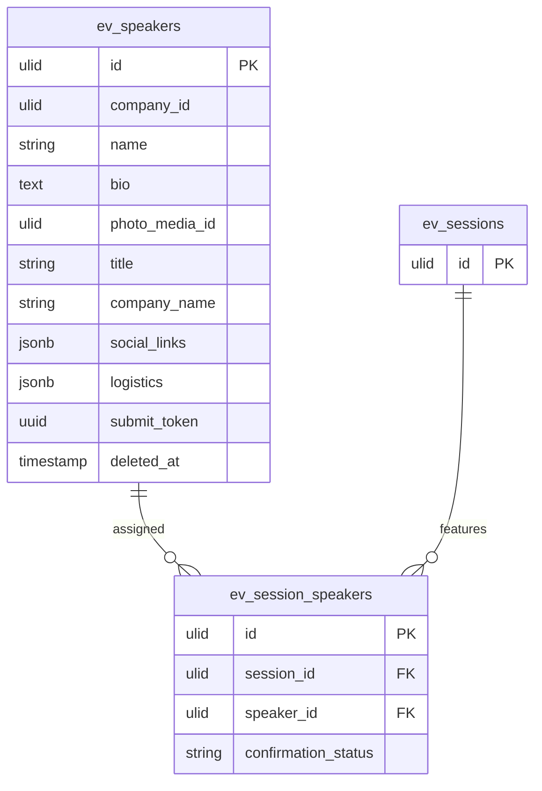

# Speakers — Data Model

## `ev_speakers`

| Column | Type | Notes |
|---|---|---|
| `id` | ulid | PK |
| `company_id` | ulid | Indexed |
| `name` | string | |
| `bio` | text | HTMLPurifier-sanitized |
| `photo_media_id` | ulid nullable | Media Library |
| `title` | string nullable | |
| `company_name` | string nullable | |
| `social_links` | jsonb | |
| `logistics` | jsonb | Internal — never public |
| `submit_token` | uuid | Unique — signed self-submit link |
| `deleted_at` | timestamp nullable | `SoftDeletes` |

## `ev_session_speakers`

| Column | Type | Notes |
|---|---|---|
| `id` | ulid | PK |
| `company_id` | ulid | Indexed |
| `session_id` | ulid | FK → `ev_sessions` |
| `speaker_id` | ulid | FK → `ev_speakers` |
| `confirmation_status` | string | invited / confirmed / declined |

**Indexes:** unique `(session_id, speaker_id)`.

## ERD

> `ev_sessions` is owned by [[../events/_module|events.events]]; shown for the FK only.
