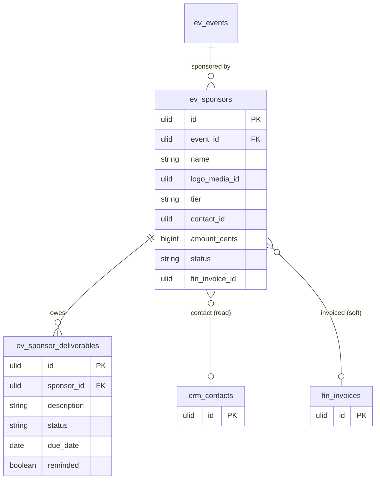

# Sponsors — Data Model

## `ev_sponsors`

| Column | Type | Notes |
|---|---|---|
| `id` | ulid | PK |
| `company_id` | ulid | Indexed |
| `event_id` | ulid | FK → `ev_events` |
| `name` | string | |
| `logo_media_id` | ulid nullable | Media Library |
| `tier` | string | platinum / gold / silver / bronze (in set) |
| `contact_id` | ulid nullable | CRM contact reference (read) |
| `amount_cents` | bigint | Sponsorship value |
| `currency` | string(3) | |
| `status` | string | committed / paid |
| `fin_invoice_id` | ulid nullable | Finance invoice reference (set by soft bridge) |
| `deleted_at` | timestamp nullable | `SoftDeletes` |

## `ev_sponsor_deliverables`

| Column | Type | Notes |
|---|---|---|
| `id` | ulid | PK |
| `company_id` | ulid | Indexed |
| `sponsor_id` | ulid | FK → `ev_sponsors` |
| `description` | string | |
| `status` | string | open / done |
| `due_date` | date nullable | |
| `reminded` | boolean | default false — idempotent reminder guard |

## ERD

> `crm_contacts` (CRM) and `fin_invoices` (Finance) are owned elsewhere; `contact_id` / `fin_invoice_id` are read/soft references. See [[../../../security/data-ownership]].
