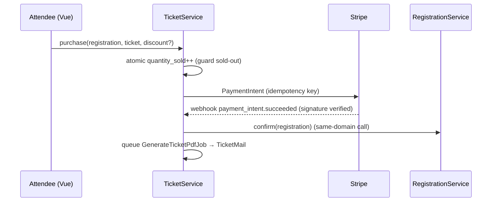

# Tickets — Architecture

## Services & Actions

| Class | Type | Responsibility |
|---|---|---|
| `TicketService::purchase()` | service | Atomic `quantity_sold` increment; apply discount (brick/money); create Stripe PaymentIntent (idempotency key). Webhook success → purchase `paid` + `RegistrationService::confirm` + queue `GenerateTicketPdfJob` → `TicketMail`. |
| `TicketService::refund()` | service | Stripe refund (idempotency key) + `RegistrationService::cancel` + decrement `quantity_sold`. |
| `GenerateTicketPdfJob` | queued job | `spatie/laravel-pdf` ticket with the registration QR. |

## Purchase Flow



## Money

- All amounts are integer minor units (`price_cents`, `amount_cents`); arithmetic via `brick/money`. Currency per ticket (`currency(3)`).

## Webhook Verification

- The inbound Stripe webhook **verifies the `Stripe-Signature` header (signing secret)** before processing payment-confirmation events (per [[../../../build/security-audit-2026-06-11]], HIGH). Webhook handled by shared Stripe routing *(assumed: per-domain event types)*.

## Filament Artifacts

| Artifact | Nav group | ui-strategy row | Notes |
|---|---|---|---|
| Ticket types relation manager | on `EventResource` | relation manager | Windows, quantities. |
| `TicketSalesWidget` | Events | #6 widget | Revenue + sold per event. |
| Purchases list | Events | #1 (read-only) | Refund action. |

### Access contract

```php
public static function canAccess(): bool
{
    return Auth::user()->can('events.tickets.view-any')
        && BillingService::hasModule('events.tickets');
}
```

Purchase flow is public (Vue + Stripe Elements, ui-strategy row #16).
