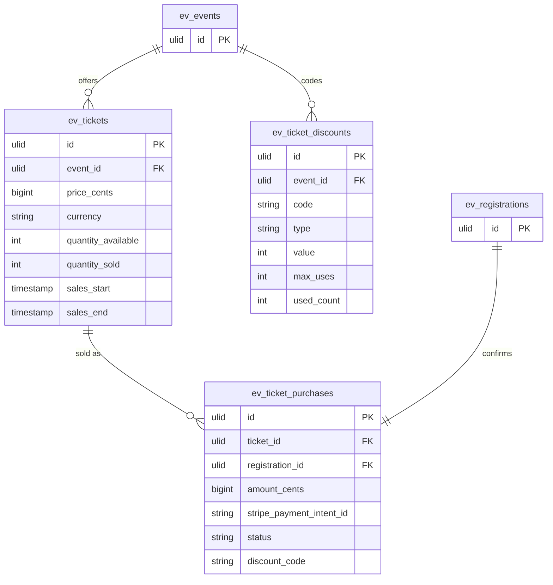

# Tickets — Data Model

## `ev_tickets`

| Column | Type | Notes |
|---|---|---|
| `id` | ulid | PK |
| `company_id` | ulid | Indexed |
| `event_id` | ulid | FK → `ev_events` |
| `name` | string | |
| `price_cents` | bigint | 0 = free |
| `currency` | string(3) | |
| `quantity_available` | int nullable | null = unlimited |
| `quantity_sold` | int | default 0; atomic |
| `sales_start` / `sales_end` | timestamp nullable | |
| `deleted_at` | timestamp nullable | `SoftDeletes` |

## `ev_ticket_purchases`

| Column | Type | Notes |
|---|---|---|
| `id` | ulid | PK |
| `company_id` | ulid | Indexed |
| `ticket_id` | ulid | FK → `ev_tickets` |
| `registration_id` | ulid | FK → `ev_registrations`, unique |
| `amount_cents` | bigint | Post-discount |
| `currency` | string(3) | |
| `stripe_payment_intent_id` | string nullable | Unique |
| `status` | string | pending / paid / refunded |
| `discount_code` | string nullable | |

## `ev_ticket_discounts` *(formalised)*

| Column | Type | Notes |
|---|---|---|
| `id` | ulid | PK |
| `company_id` | ulid | Indexed |
| `event_id` | ulid | FK → `ev_events` |
| `code` | string | Unique per event |
| `type` | string | percent / fixed |
| `value` | int | Percent (0–100) or fixed cents |
| `max_uses` | int nullable | |
| `used_count` | int | default 0 |

## ERD

