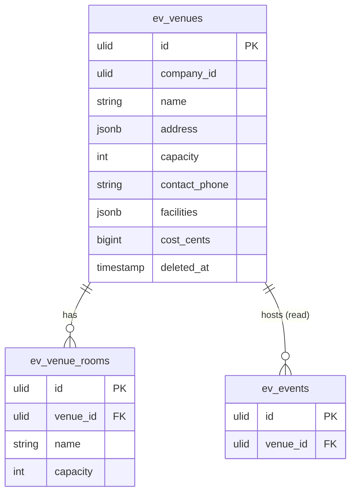

# Venues — Data Model

## `ev_venues`

| Column | Type | Notes |
|---|---|---|
| `id` | ulid | PK |
| `company_id` | ulid | Indexed |
| `name` | string | |
| `address` | jsonb | Structured address |
| `capacity` | int | |
| `contact_name` | string nullable | |
| `contact_phone` | string nullable | E.164 (`propaganistas/laravel-phone`) |
| `facilities` | jsonb | |
| `cost_cents` | bigint nullable | |
| `deleted_at` | timestamp nullable | `SoftDeletes`; blocked while referenced by upcoming events *(assumed)* |

## `ev_venue_rooms`

| Column | Type | Notes |
|---|---|---|
| `id` | ulid | PK |
| `company_id` | ulid | Indexed |
| `venue_id` | ulid | FK → `ev_venues` |
| `name` | string | |
| `capacity` | int | |

**Indexes:** unique `(venue_id, name)`.

## ERD

> `ev_events` is owned by [[../events/_module|events.events]]; shown for the reference only.
