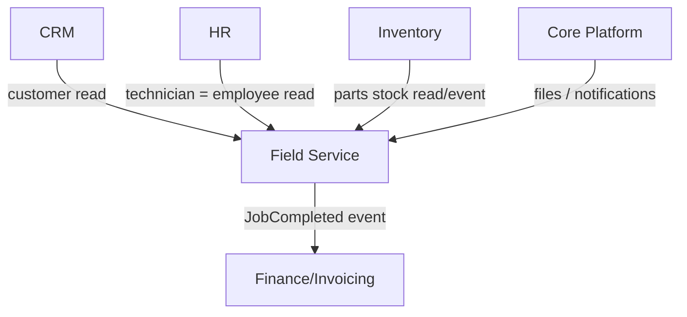

# Field Service

Work orders, technician dispatch/scheduling, parts inventory, asset maintenance, and a mobile technician
surface — for verticals like HVAC, maintenance, and utilities. Replaces ServiceTitan / Jobber /
Housecall Pro at the SMB tier, sharing customers, invoicing, and inventory with the rest of the suite.

**Why deferred:** vertical-specific; earns its place only when FlowFlex targets a field-service customer
segment. Explode fully when that segment is concrete.

## Intended Modules *(assumed — no prior spec)*

| Module | Key | One-line purpose | UI kind guess |
|---|---|---|---|
| Work Orders | field.work-orders | Job lifecycle: create → schedule → complete → invoice | custom Filament page + resource |
| Dispatch & Scheduling | field.dispatch | Assign techs, drag-drop calendar, route/geo view | custom Filament page (dispatch board) |
| Technicians | field.technicians | Tech roster, skills, availability, certifications | Filament resource (reads HR) |
| Parts Inventory | field.parts | Van + warehouse stock, consumption per job | Filament resource (reads/links Inventory) |
| Assets & Maintenance | field.assets | Customer equipment register + PM schedules | Filament resource + calendar |
| Estimates & Quotes | field.estimates | Job estimates → approval → work order | Filament resource |
| Mobile Tech App | field.mobile | On-site job view, checklists, photos, sign-off | Vue/Inertia (mobile portal/PWA) |
| Service Agreements | field.agreements | Recurring contracts, SLAs, entitlement | Filament resource |
| Dashboard | field.dashboard | Ops overview: jobs, SLA, tech utilisation | Filament dashboard + widgets |

## Cross-Domain Relations

| Direction | Counterpart domain | Coupling |
|---|---|---|
| consumes | CRM | read (customer / contact) |
| feeds | Finance/Invoicing | event (job completed → invoice) |
| consumes | Inventory | read + event (parts stock) |
| consumes | HR | read (technician = employee) |
| consumes | Core | read (files, notifications, scheduling) |

Full explosion into module/feature notes (with per-feature `## UI` + `## Relations`) happens when this
domain leaves `build-status: deferred`.
