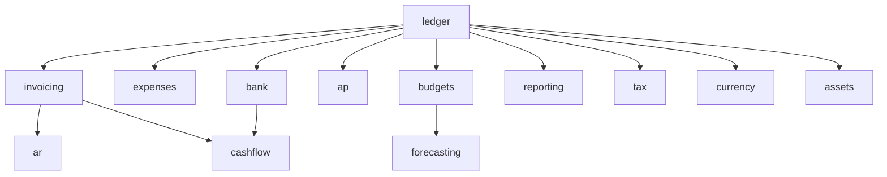

# Finance & Accounting

Complete accounting stack: general ledger, invoicing, expenses, AP/AR, bank reconciliation, budgets, financial reporting, and FP&A. **Panel:** `/finance` (Emerald). Milestone M3 in [[../../build/ROADMAP]].

**Displaces**: Xero, QuickBooks, Sage, FreshBooks.

> Rebuild blueprint. The finance code was stripped to the [[../../decisions/decision-2026-06-19-strip-to-app-admin-shell|app/admin shell]]; every module below is `build-status: planned`. These specs are the source of truth for the rebuild — nothing here is built, shipped, or tested yet.

---

## Navigation Groups

- **Ledger** — General Ledger, Bank Accounts, Fixed Assets
- **Invoicing** — Invoices, Accounts Receivable
- **Expenses** — Expenses, Accounts Payable
- **Planning** — Budgets, Forecasting, Cash Flow
- **Reporting** — Financial Reports, Tax Management, Multi-Currency

---

## Modules

| Module | Key | Priority | Build-status | Depends on (intra-domain) | Kind highlights |
|---|---|---|---|---|---|
| [[general-ledger/_module\|General Ledger]] | `finance.ledger` | v1-core | planned | — (anchor) | resource ×3 + trial-balance report page (#9) |
| [[invoicing/_module\|Invoicing]] | `finance.invoicing` | v1-core | planned | ledger | resource ×2 (pdf-preview, line repeater) + stats widget (#6) |
| [[expenses/_module\|Expenses]] | `finance.expenses` | v1-core | planned | ledger | resource ×3 (state-badge, receipt upload) |
| [[bank-accounts/_module\|Bank Accounts]] | `finance.bank` | v1-core | planned | ledger | resource ×2 + import wizard (#7) + reconciliation matcher (#9*) |
| [[accounts-receivable/_module\|Accounts Receivable]] | `finance.ar` | v1 | planned | invoicing | resource + aging/statement report pages (#9) + money actions |
| [[accounts-payable/_module\|Accounts Payable]] | `finance.ap` | v1 | planned | ledger | resource ×2 + aging + payment-run report pages (#9) |
| [[budgets/_module\|Budgets]] | `finance.budgets` | v1 | planned | ledger | resource + variance report page (#9) + widget (#6) |
| [[financial-reporting/_module\|Financial Reporting]] | `finance.reporting` | v1 | planned | ledger | P&L / balance-sheet / cash-flow report pages (#9) |
| [[tax-management/_module\|Tax Management]] | `finance.tax` | v1 | planned | ledger | resource + tax-return report page (#9) |
| [[multi-currency/_module\|Multi-Currency]] | `finance.currency` | v1 | planned | ledger | resource ×2 + FX gain/loss report page (#9) |
| [[forecasting/_module\|Forecasting]] | `finance.forecasting` | v1 | planned | ledger, budgets | resource + comparison report page (#9) |
| [[cash-flow/_module\|Cash Flow]] | `finance.cashflow` | v1 | planned | invoicing, bank | cash-flow report page (#9) + low-cash widget (#6) |
| [[fixed-assets/_module\|Fixed Assets]] | `finance.assets` | v1 | planned | ledger | resource + depreciation-run wizard (#7) |

`#9*` — bank reconciliation is a two-panel matcher with no exact ui-strategy row; cited as closest (#9), flagged for a possible new blueprint kind (see [[../../build/gaps/INDEX|open gaps]]).

Build order: ledger → invoicing → expenses → bank → AR/AP → budgets/reporting/tax → rest ([[../../build/BUILD-ORDER]]).

> `financial-reporting` is the canonical reporting note. Any reference to "finance/reporting" resolves to [[financial-reporting/_module]].

## Dependency Graph (intra-domain)

## Cross-Domain Edges

| Direction | Event | Counterpart |
|---|---|---|
| Fires | `InvoicePaid` (invoicing) | CRM account update, AR aging, sequences |
| Fires | `ExpenseApproved` (expenses) | hr.payroll reimbursement |
| Consumes | `PayrollRunApproved` (hr.payroll) | ledger journal entry |
| Consumes | `DealWon` (crm.deals) | invoicing draft stub |

Payload contracts: [[../../architecture/event-bus]]. AP additionally consumes PO/GRN events when operations/procurement build (P3 — contracts added then).

---

## Absorbed Domains

**FP&A** (formerly standalone) — budgeting and forecasting live in [[budgets/_module]] and [[forecasting/_module]].

---

## Key Patterns

- `spatie/laravel-model-states` — invoice status, expense status, bill status.
- `lorisleiva/laravel-actions` — simpler operations like `MarkInvoiceAsPaid`, `RecalculateInvoiceTotals`.
- All amounts stored as integer minor units (cents) via `brick/money` — never floats ([[../../architecture/packages]]).
- Currency from [[../core/company-settings/_module]] — no per-record currency unless Multi-Currency module active.
- All ledger writes through `LedgerService::post` — posted entries immutable, reversals only.

---

## Related

- [[../../architecture/event-bus]]
- [[../../security/encryption]] — IBAN / bank account encryption (bank-accounts)
- [[../../glossary]]
- [[../../decisions/decision-2026-06-19-strip-to-app-admin-shell]]
