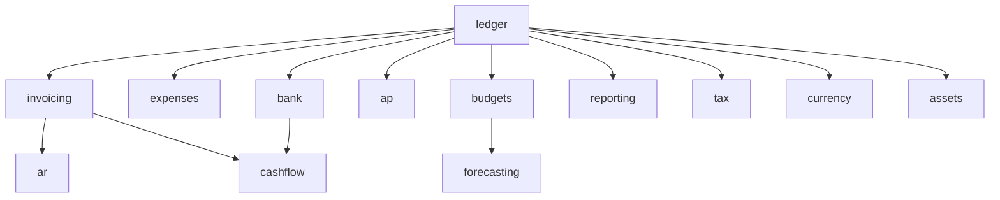

# Finance & Accounting

Complete accounting stack: general ledger, invoicing, expenses, AP/AR, bank reconciliation, budgets, financial reporting, and FP&A features. **Panel:** `/finance` (Emerald). Milestone M3 in [[build/ROADMAP]].

**Displaces**: Xero, QuickBooks, Sage, FreshBooks

---

## Navigation Groups

- **Ledger** — General Ledger, Bank Accounts, Fixed Assets
- **Invoicing** — Invoices, Accounts Receivable
- **Expenses** — Expenses, Accounts Payable
- **Planning** — Budgets, Forecasting, Cash Flow
- **Reporting** — Financial Reports, Tax Management, Multi-Currency

---

## Modules

| Module | Key | Status | Priority | Depends on (intra-domain) |
|---|---|---|---|---|
| [[domains/finance/general-ledger\|General Ledger]] | `finance.ledger` | planned | v1-core | — (anchor) |
| [[domains/finance/invoicing\|Invoicing]] | `finance.invoicing` | planned | v1-core | ledger |
| [[domains/finance/expenses\|Expenses]] | `finance.expenses` | planned | v1-core | ledger |
| [[domains/finance/bank-accounts\|Bank Accounts]] | `finance.bank` | planned | v1-core | ledger |
| [[domains/finance/accounts-receivable\|Accounts Receivable]] | `finance.ar` | planned | v1 | invoicing |
| [[domains/finance/accounts-payable\|Accounts Payable]] | `finance.ap` | planned | v1 | ledger |
| [[domains/finance/budgets\|Budgets]] | `finance.budgets` | planned | v1 | ledger |
| [[domains/finance/financial-reporting\|Financial Reporting]] | `finance.reporting` | planned | v1 | ledger |
| [[domains/finance/tax-management\|Tax Management]] | `finance.tax` | planned | v1 | ledger |
| [[domains/finance/multi-currency\|Multi-Currency]] | `finance.currency` | planned | v1 | ledger |
| [[domains/finance/forecasting\|Forecasting]] | `finance.forecasting` | planned | v1 | ledger, budgets |
| [[domains/finance/cash-flow\|Cash Flow]] | `finance.cashflow` | planned | v1 | invoicing, bank |
| [[domains/finance/fixed-assets\|Fixed Assets]] | `finance.assets` | planned | v1 | ledger |

Build order: ledger → invoicing → expenses → bank → AR/AP → budgets/reporting/tax → rest ([[build/BUILD-ORDER]]).

## Dependency Graph (intra-domain)



## Cross-Domain Edges

| Direction | Event | Counterpart |
|---|---|---|
| Fires | `InvoicePaid` (invoicing) | CRM account update, AR aging, sequences |
| Fires | `ExpenseApproved` (expenses) | hr.payroll reimbursement |
| Consumes | `PayrollRunApproved` (hr.payroll) | ledger journal entry |
| Consumes | `DealWon` (crm.deals) | invoicing draft stub |

Payload contracts: [[architecture/event-bus]]. AP additionally consumes PO/GRN events when operations/procurement build (P3 — contracts added then).

---

## Status Board (Dataview)

```dataview
TABLE module-key AS "Key", status AS "Status", priority AS "Priority"
FROM "domains/finance"
WHERE type = "module"
SORT priority ASC, module-key ASC
```

---

## Absorbed Domains

**FP&A** (formerly standalone) — budgeting and forecasting live in [[domains/finance/budgets]] and [[domains/finance/forecasting]].

---

## Key Patterns

- `spatie/laravel-model-states` — invoice status, expense status, bill status
- `lorisleiva/laravel-actions` — simpler operations like `MarkInvoiceAsPaid`, `RecalculateInvoiceTotals`
- All amounts stored as integers (cents/minor currency units) — never floats ([[build/decisions/decision-2026-06-01-currency-precision]])
- Currency from [[domains/core/company-settings]] — no per-record currency unless Multi-Currency module active
- All ledger writes through `LedgerService::post` — posted entries immutable, reversals only
