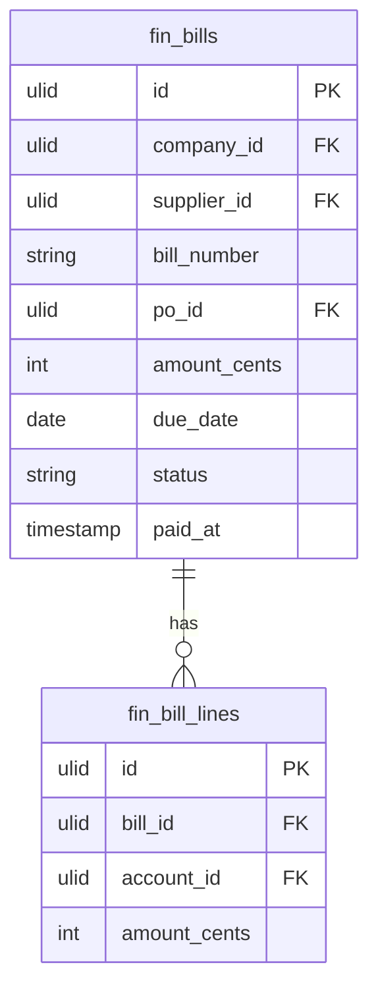

# Accounts Payable

Supplier bill management, payment scheduling, AP aging, and approval workflow. Receives bills from Operations/Procurement; pays suppliers.

## Core Features

- Bill record: supplier, bill number, amount, due date, status, linked PO
- Status machine: `draft → approved → scheduled → paid` (spatie/laravel-model-states)
- Bill approval workflow (by amount threshold)
- 3-way match gate: bill matched to PO + goods receipt before payment (when Procurement active)
- Payment scheduling: batch payments by due date
- AP aging report: current, 30, 60, 90+ days
- Payment run: select bills, generate payment batch
- Early-payment discount handling
- Posts to General Ledger on payment

## Data Model

| Table | Key Columns |
|---|---|
| `fin_bills` | company_id, supplier_id, bill_number, po_id, amount_cents, currency, bill_date, due_date, status, approved_by, paid_at |
| `fin_bill_lines` | bill_id, company_id, description, account_id, amount_cents |
| `fin_payment_runs` | company_id, run_date, total_cents, status |

## Filament

**Nav group:** Expenses

- `BillResource` — list, create, approve, schedule payment
- `ApAgingPage` (custom page) — aging report
- `PaymentRunPage` (custom page) — batch payment selection

## Cross-Domain / Events

- Consumes `PurchaseOrderReceived` / `GoodsReceived` → create bill
- Match approval from Procurement releases bill for payment
- Posts journal entries to [[domains/finance/general-ledger]]

## Related

- [[domains/finance/general-ledger]]
- [[domains/operations/purchase-orders]]
- [[domains/procurement/goods-receipt]]
