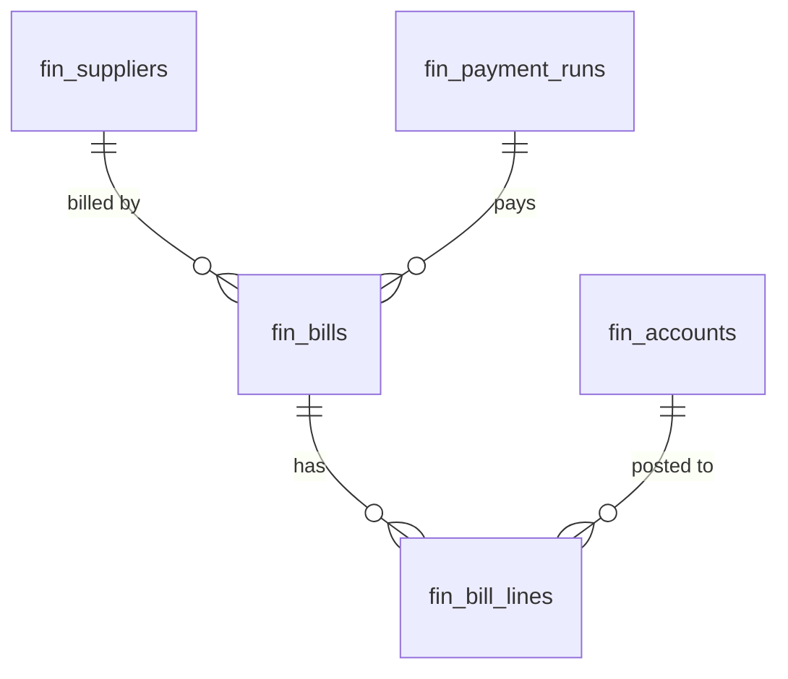

# Accounts Payable — Data Model

All monetary columns are `bigint` integer **minor units** (cents), handled with `brick/money`. Tenancy via `company_id` per [[../../../security/tenancy-isolation]]. AP owns all four tables below.

## fin_suppliers *(new vs v1 spec)*

| Column | Type | Notes |
|---|---|---|
| id, company_id (indexed) | ulid | |
| name | string | |
| email | string | nullable |
| vat_number | string | nullable |
| 🔐 iban | text | nullable, **encrypted**, `iban_last4` for display |
| payment_terms_days | int | default 30 |
| deleted_at | timestamp | nullable |

## fin_bills

| Column | Type | Constraints | Notes |
|---|---|---|---|
| id, company_id (indexed), supplier_id FK | ulid | | |
| bill_number | string | unique `(company_id, supplier_id, bill_number)` | supplier's number |
| po_id | ulid | nullable | operations link |
| amount_cents | bigint | > 0 | minor units |
| currency | string(3) | | |
| bill_date / due_date | date | due ≥ bill | |
| status | string | default `draft` | `BillState` machine |
| early_discount_percent / early_discount_until | decimal / date | nullable | |
| approved_by | ulid | nullable | |
| paid_at | timestamp | nullable | |
| payment_run_id | ulid | nullable FK | |
| deleted_at | timestamp | nullable | kept 7y |

**Indexes:** `(company_id, status, due_date)`

## fin_bill_lines

| Column | Type | Notes |
|---|---|---|
| id, bill_id FK, company_id | ulid | |
| description | string | |
| account_id | ulid FK fin_accounts | expense account |
| amount_cents | bigint | sum(lines) == bill amount (cross-check) |

## fin_payment_runs

| Column | Type | Notes |
|---|---|---|
| id, company_id (indexed) | ulid | |
| run_date | date | |
| total_cents | bigint | minor units |
| status | string default `draft` | draft / executed |

## ERD

`fin_bill_lines.account_id` references the `fin_accounts` table owned by [[../general-ledger/_module|finance.ledger]].

See [[architecture]], [[../../../architecture/patterns/encryption]], [[../../../architecture/performance]].
