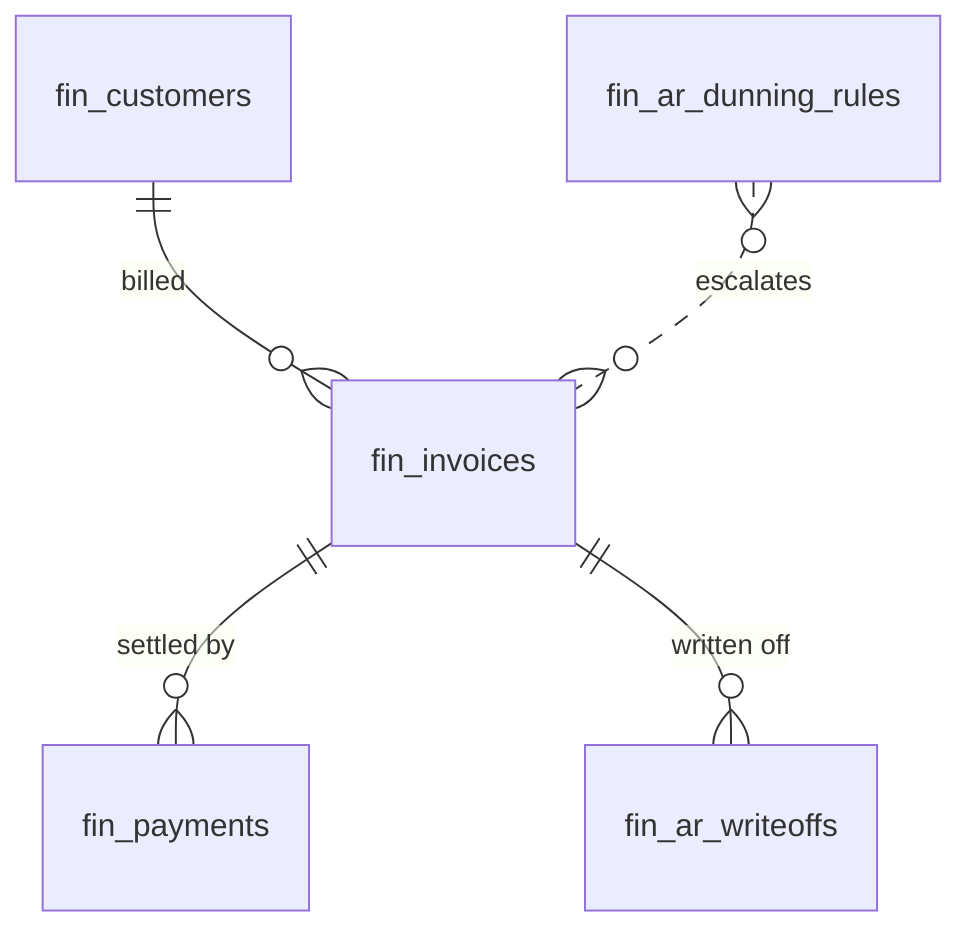

# Accounts Receivable — Data Model

All monetary columns are `bigint` integer **minor units** (cents), handled with `brick/money`. Tenancy via `company_id` per [[../../../security/tenancy-isolation]].

AR owns two tables (`fin_ar_dunning_rules`, `fin_ar_writeoffs`) and adds columns to invoicing-owned tables. It **reads** aging and statement data from `fin_invoices` + `fin_payments`, owned by [[../invoicing/_module|finance.invoicing]].

## fin_ar_dunning_rules

| Column | Type | Notes |
|---|---|---|
| id, company_id (indexed) | ulid | |
| aging_bucket | string | 1-30 / 31-60 / 61-90 / 90+ |
| days_overdue | int | trigger threshold |
| email_template | string | template key |
| escalation_level | int | 1..n, unique `(company_id, escalation_level)` |
| is_active | boolean | default true |

## fin_ar_writeoffs

| Column | Type | Notes |
|---|---|---|
| id, company_id (indexed), invoice_id FK | ulid | |
| amount_cents | bigint | minor units |
| reason | text | required |
| approved_by | ulid FK users | |
| written_off_at | timestamp | |

## Columns added to invoicing-owned tables

| Table | Column | Type | Notes |
|---|---|---|---|
| fin_invoices | last_dunning_level | int | dunning tracking *(assumed column added by this module)* |
| fin_customers | credit_limit_cents | bigint | credit-limit tracking *(assumed column added by this module)* |

## Source tables (read-only, owned by invoicing)

- `fin_invoices` — open balance, due date, customer drive the aging buckets and dunning.
- `fin_payments` — applied payments reduce open balance and feed allocation + DSO.

## ERD

See [[architecture]], [[../invoicing/_module]], [[../../../architecture/performance]].
