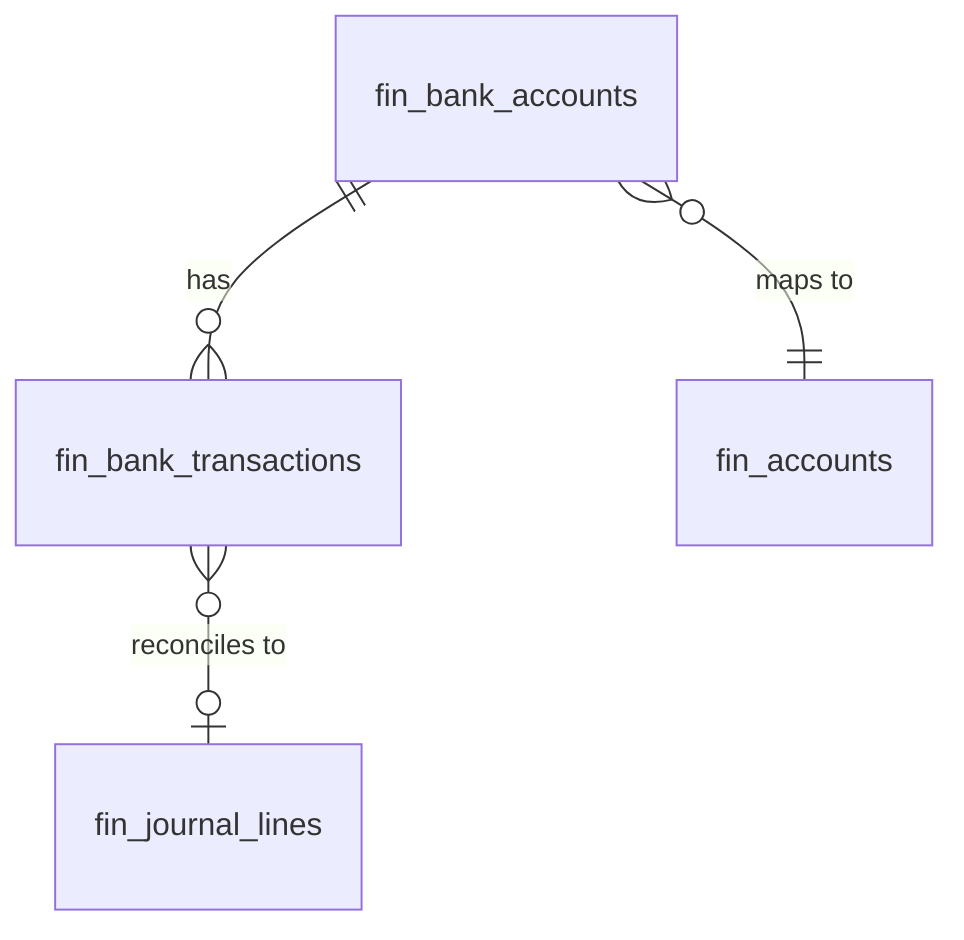

# Bank Accounts — Data Model

All monetary columns are `bigint` integer **minor units** (cents), handled with `brick/money`. Tenancy via `company_id` per [[../../../security/tenancy-isolation]]. Encrypted columns are `text` per [[../../../security/encryption]].

## fin_bank_accounts

| Column | Type | Constraints | Notes |
|---|---|---|---|
| id, company_id (indexed) | ulid | | |
| name / bank_name | string | not null | |
| 🔐 account_number | text | nullable | encrypted |
| 🔐 iban | text | nullable | encrypted; `iban_last4` string for display *(assumed)* |
| currency | string(3) | not null | |
| gl_account_id | ulid | not null FK fin_accounts | asset account |
| current_balance_cents | bigint | default 0 | updated on import |
| deleted_at | timestamp | nullable | |

## fin_bank_transactions

| Column | Type | Constraints | Notes |
|---|---|---|---|
| id, company_id (indexed), bank_account_id FK | ulid | | |
| transaction_date | date | not null | |
| description | string | not null | |
| amount_cents | bigint | not null | signed, minor units |
| import_hash | string | unique `(bank_account_id, import_hash)` | dedupe on re-import (date+amount+description hash) |
| reconciled_at | timestamp | nullable | |
| journal_line_id | ulid | nullable FK | match target |

**Indexes:** `(company_id, bank_account_id, reconciled_at)`

## ERD

See [[architecture]], [[../../../architecture/data-model]].
