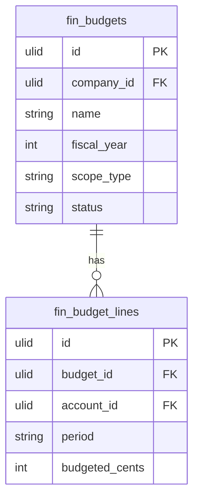

# Budgets

Department and company-level budgets with actual-vs-budget variance tracking. Absorbed from the former FP&A domain.

## Core Features

- Budget record: name, fiscal year, scope (company/department/project)
- Budget lines: per GL account, per period (monthly breakdown)
- Import actuals from General Ledger automatically
- Variance report: budget vs actual, absolute and %
- Variance alerts: notify when actual exceeds budget by threshold
- Budget approval workflow
- Copy budget from previous year as starting point
- Budget versions (revisions during the year)
- Rolling forecast view (links Forecasting)

## Data Model

| Table | Key Columns |
|---|---|
| `fin_budgets` | company_id, name, fiscal_year, scope_type, scope_id, status, version |
| `fin_budget_lines` | budget_id, company_id, account_id, period, budgeted_cents |

## Filament

**Nav group:** Planning

- `BudgetResource` — create, edit budget lines, approve
- `BudgetVariancePage` (custom page) — budget vs actual with variance highlighting
- `BudgetVarianceWidget` — over-budget alerts

## Cross-Domain

- Actuals pulled from [[domains/finance/general-ledger]]
- Budget check consumed by Procurement requisitions, HR workforce planning

## Related

- [[domains/finance/general-ledger]]
- [[domains/finance/forecasting]]
- [[domains/procurement/requisitions]]
