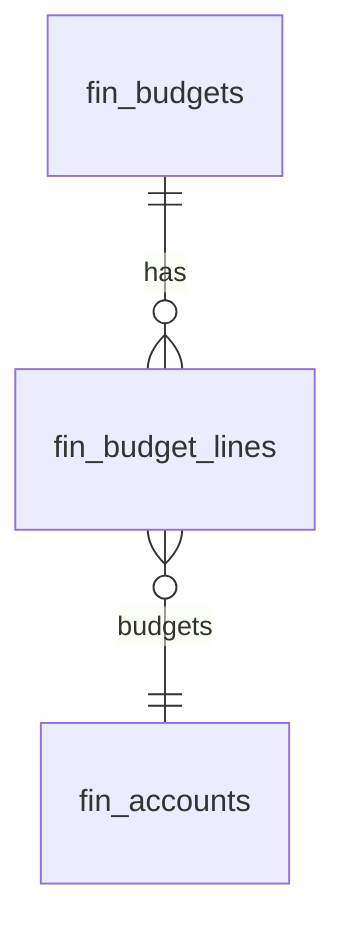

# Budgets — Data Model

All monetary columns are `bigint` integer **minor units** (cents), handled with `brick/money`. Tenancy via `company_id` per [[../../../security/tenancy-isolation]]. The module owns the two tables below; actuals are **read** from the general ledger (`fin_journal_lines`).

## fin_budgets

| Column | Type | Notes |
|---|---|---|
| id, company_id (indexed) | ulid | |
| name | string | |
| fiscal_year | int | |
| scope_type | string | company / department / project |
| scope_id | ulid nullable | dept/project ref (null for company scope) |
| status | string default `draft` | draft / approved |
| version | int default 1 | unique `(company_id, name, fiscal_year, version)` |
| deleted_at | timestamp nullable | soft delete |

## fin_budget_lines

| Column | Type | Notes |
|---|---|---|
| id, budget_id FK, company_id | ulid | |
| account_id | ulid FK fin_accounts | |
| period | string | `YYYY-MM`, unique `(budget_id, account_id, period)` |
| budgeted_cents | bigint | minor units |

## ERD

Source tables read (owned elsewhere): `fin_journal_entries` / `fin_journal_lines` (actuals for variance).

See [[architecture]], [[../general-ledger/data-model]].
