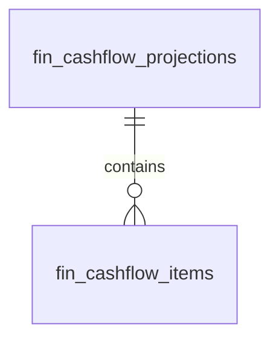

# Cash Flow — Data Model

All monetary columns are `bigint` integer **minor units** (cents), handled with `brick/money`. Tenancy via `company_id` per [[../../../security/tenancy-isolation]]. The module owns the two tables below but **reads** source data from invoicing (open invoices + due dates), bank accounts (opening cash), AP (scheduled bills), and payroll (outflow estimates).

## fin_cashflow_projections

| Column | Type | Notes |
|---|---|---|
| id, company_id (indexed) | ulid | |
| week_start | date | unique `(company_id, week_start, is_actual)` |
| opening_cents / inflow_cents / outflow_cents / closing_cents | bigint | minor units |
| is_actual | boolean | actual rows backfilled weekly; projected rows rebuilt nightly |

## fin_cashflow_items

| Column | Type | Notes |
|---|---|---|
| id, projection_id FK, company_id | ulid | |
| type | string | inflow / outflow |
| source | string | invoice / bill / payroll / manual |
| source_id | ulid nullable | origin record (null for manual) |
| description | string | |
| amount_cents | bigint | minor units |
| expected_date | date | drives which week the item lands in |

## ERD

Source tables read (owned elsewhere): invoices, bank accounts, AP bills, payroll runs.

See [[architecture]], [[../invoicing/data-model]], [[../bank-accounts/data-model]].
