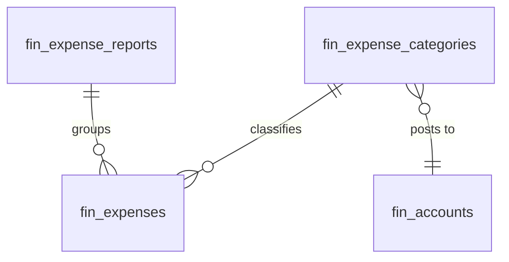

# Expenses — Data Model

All monetary columns are `bigint` integer **minor units** (cents), handled with `brick/money`. Tenancy via `company_id` per [[../../../security/tenancy-isolation]].

## fin_expenses

| Column | Type | Constraints | Notes |
|---|---|---|---|
| id, company_id (indexed) | ulid | | |
| user_id | ulid | not null FK users | submitter |
| employee_id | ulid | nullable FK hr_employees | when HR active |
| category_id | ulid | not null FK | |
| amount_cents | bigint | > 0 | minor units |
| currency | string(3) | not null | |
| expense_date | date | not null, not future | |
| merchant | string | not null | |
| description | text | nullable | |
| status | string | default `draft` | state machine |
| is_over_limit | boolean | default false | policy flag |
| approved_by | ulid | nullable | |
| report_id | ulid | nullable FK | |
| reimbursed_via | string | nullable | payroll / bank-transfer |
| deleted_at | timestamp | nullable | |

**Indexes:** `(company_id, status)`, `(company_id, user_id)`

## fin_expense_categories

| Column | Type | Notes |
|---|---|---|
| id, company_id (indexed) | ulid | |
| name | string | unique per company |
| limit_per_transaction_cents | bigint nullable | null = no limit |
| gl_account_id | ulid FK fin_accounts | posting target |
| deleted_at | timestamp | nullable |

## fin_expense_reports

| Column | Type | Notes |
|---|---|---|
| id, company_id (indexed), user_id FK | ulid | |
| title | string | |
| period_start / period_end | date | |
| status | string default `draft` | draft / submitted / approved / rejected |
| submitted_at / approved_at | timestamp nullable | |

## ERD

See [[architecture]], [[../../../architecture/data-model]].
