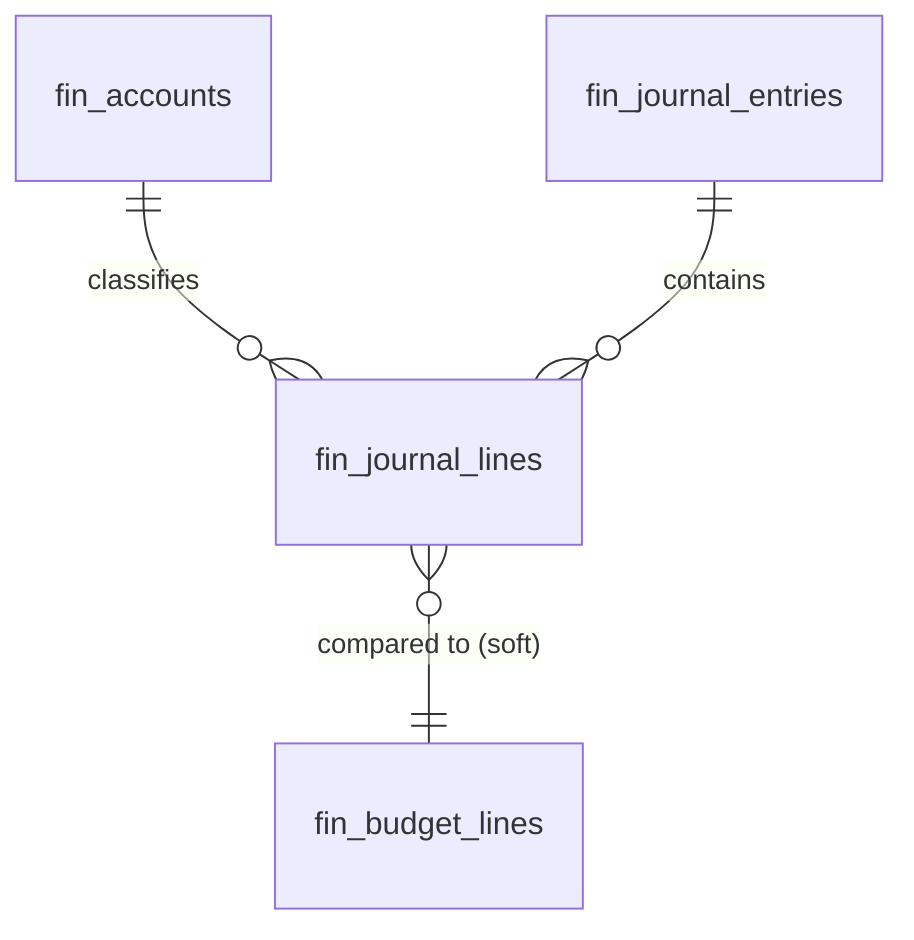

# Financial Reporting — Data Model

**This module owns no tables.** Every statement is generated at request time from the general ledger. All monetary math is integer **minor units** (cents) via `brick/money`. Tenancy is inherited from the source tables' `company_id` scope per [[../../../security/tenancy-isolation]].

## Source tables (owned by General Ledger)

| Table | Used for |
|---|---|
| `fin_accounts` | account `type` + code ranges drive statement section mapping |
| `fin_journal_entries` | posted entries, period selection |
| `fin_journal_lines` | debit/credit amounts summed into statement lines (integer cents) |

Budgeted comparison figures are read from `fin_budget_lines` (budgets module) when active.

## ERD

No migrations ship with this module; the Build Manifest contains only DTOs, service, pages, and tests.

See [[architecture]], [[../general-ledger/data-model]], [[../budgets/data-model]].
