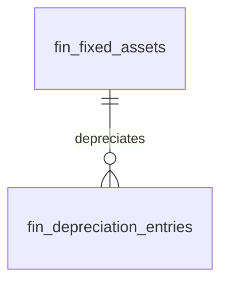

# Fixed Assets

Fixed asset register, depreciation schedules, and disposal tracking. Capitalised assets accounted over their useful life.

---

## Dependencies

| Type | Module | Why |
|---|---|---|
| Hard | [[domains/finance/general-ledger\|finance.ledger]] | depreciation + disposal entries post to GL |
| Hard | [[domains/core/billing-engine\|core.billing]] + [[domains/core/rbac\|core.rbac]] | gating + permissions |
| Soft | [[domains/it/asset-inventory\|it.asset-inventory]] | physical ↔ financial asset link (P3); standalone register without it |

---

## Core Features

- Asset record: name, category, cost, purchase date, useful life, depreciation method, salvage value
- Depreciation methods: straight-line, declining balance, units of production *(v1: straight-line + declining; units-of-production deferred *(assumed)*)*
- Monthly depreciation calculation + auto-post journal entry to GL
- Net book value: cost − accumulated depreciation
- Asset disposal: sale/scrap with gain/loss calculation → GL entry
- Asset categories with default depreciation settings
- Depreciation schedule view (full life projection)
- Links to IT Asset Inventory (physical asset ↔ financial asset)

---

## Data Model

### fin_fixed_assets

| Column | Type | Constraints | Notes |
|---|---|---|---|
| id, company_id (indexed) | ulid | | |
| name | string | not null | |
| category | string | not null | category defaults applied at create |
| cost_cents | bigint | > 0 | |
| purchase_date | date | not null | |
| useful_life_months | int | > 0 | |
| method | string | straight-line / declining | |
| salvage_cents | bigint | ≥ 0, < cost | |
| accumulated_depreciation_cents | bigint | default 0 | |
| status | string | default `active` | active / fully-depreciated / disposed |
| it_asset_id | ulid | nullable | P3 link |
| disposed_at | timestamp | nullable | |
| disposal_proceeds_cents | bigint | nullable | |
| deleted_at | timestamp | nullable | |

### fin_depreciation_entries

| Column | Type | Notes |
|---|---|---|
| id, asset_id FK, company_id (indexed) | ulid | |
| period | string | `YYYY-MM`, unique `(asset_id, period)` |
| depreciation_cents | bigint | |
| journal_entry_id | ulid FK | the GL posting |



---

## DTOs

### CreateAssetData — name, category, cost_cents (min:1), purchase_date (not future), useful_life_months (min:1), method (in set), salvage_cents (< cost — "Salvage value must be below cost.")
### DisposeAssetData — asset_id, disposal_proceeds_cents (≥ 0), disposed_at (≥ purchase_date)

## Services & Actions

- `FixedAssetService::create(CreateAssetData $data): AssetData`
- `FixedAssetService::schedule(string $assetId): Collection` — full-life projection (brick/money, final period absorbs rounding remainder)
- `FixedAssetService::runMonthlyDepreciation(string $period): DepreciationResult` — per asset: compute, post GL, record entry; sets fully-depreciated at NBV = salvage
- `FixedAssetService::dispose(DisposeAssetData $data): AssetData` — gain/loss = proceeds − NBV → GL entry; throws `AlreadyDisposedException`

## Jobs & Scheduling

| Job / Command | Queue | Schedule | Idempotency |
|---|---|---|---|
| `RunDepreciationCommand` | finance | monthly, 1st 02:30 | unique `(asset, period)` — re-run skips done assets, continues on per-asset failure |

---

## Filament

**Nav group:** Ledger

| Artifact | Kind ([[architecture/ui-strategy]] row) | Notes |
|---|---|---|
| `FixedAssetResource` | #1 CRUD resource | NBV column; schedule relation view; dispose action |
| `DepreciationRunPage` | #7 custom page | run month, preview + post, result summary |


**Access contract:** every artifact above gates on `canAccess() = Auth::user()->can('finance.assets.view-any') && BillingService::hasModule('finance.assets')` per [[architecture/filament-patterns]] #1 — custom pages state it explicitly. Public/portal surfaces use a guest or scoped-portal guard (Vue+Inertia per [[architecture/ui-strategy]]).

---

## Permissions

`finance.assets.view-any` · `finance.assets.create` · `finance.assets.update` · `finance.assets.run-depreciation` · `finance.assets.dispose`

---

## Test Checklist

- [ ] Tenant isolation + module gating
- [ ] Straight-line schedule sums exactly to cost − salvage (rounding absorbed in final period)
- [ ] Declining-balance never depreciates below salvage
- [ ] Monthly run idempotent; per-asset failure doesn't stop batch
- [ ] Each depreciation entry has balanced GL posting
- [ ] Disposal gain/loss correct vs NBV; double disposal rejected
- [ ] Fully-depreciated status set at end of life

---

## Build Manifest

```
database/migrations/xxxx_create_fin_fixed_assets_table.php
database/migrations/xxxx_create_fin_depreciation_entries_table.php
app/Models/Finance/{FixedAsset,DepreciationEntry}.php
app/Data/Finance/{CreateAssetData,DisposeAssetData,AssetData}.php
app/Services/Finance/FixedAssetService.php
app/Exceptions/Finance/AlreadyDisposedException.php
app/Console/Commands/Finance/RunDepreciationCommand.php
app/Filament/Finance/Resources/FixedAssetResource.php
app/Filament/Finance/Pages/DepreciationRunPage.php
database/factories/Finance/FixedAssetFactory.php
tests/Feature/Finance/{DepreciationTest,AssetDisposalTest}.php
```

---

## Related

- [[domains/finance/general-ledger]]
- [[domains/it/asset-inventory]]
